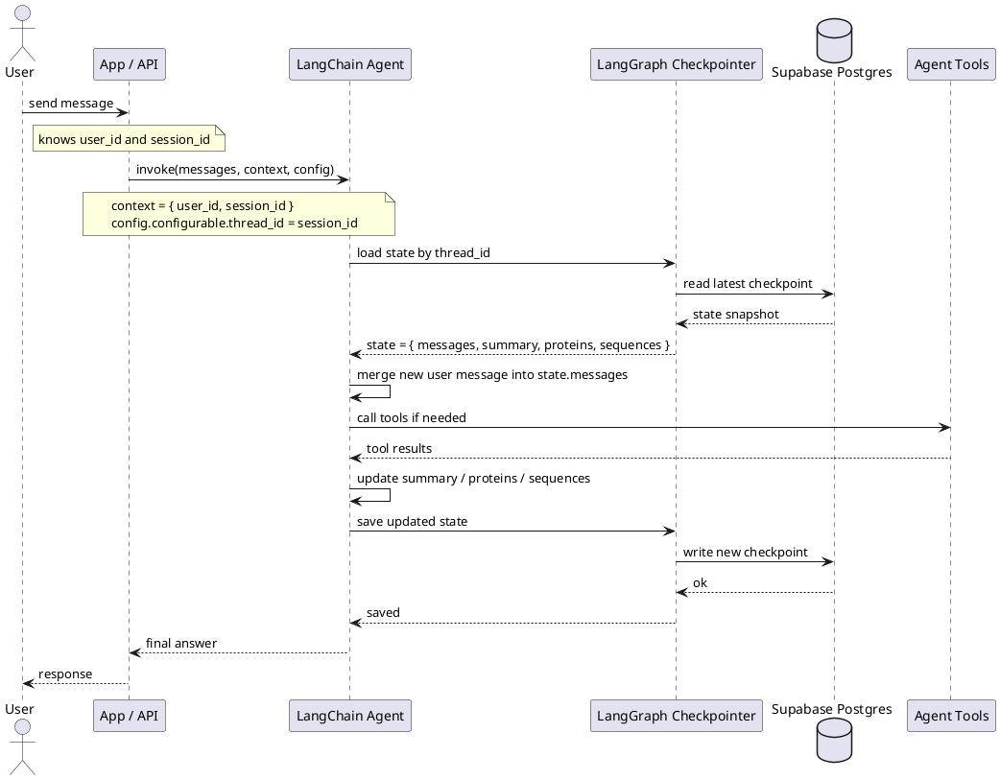

# LangChain Session Strategy with Supabase

Status: Draft
Last Updated: 2026-04-27

## Goal

Понять, как правильно организовать сессии для простого LangChain/LangGraph-агента с хранением данных в Supabase, и зафиксировать практичный план внедрения для нашего проекта.

## Short Answer

Для актуального стека LangChain v1 / LangGraph лучше мыслить не одной сущностью "session", а как минимум двумя слоями:

1. `thread_id` / conversation thread
Это короткая память конкретного диалога. Ее лучше хранить через `checkpointer`.

2. `user memory`
Это долгоживущие данные пользователя между разными сессиями. Их лучше хранить в `store`.

Для нашего текущего MVP этого уже достаточно. Отдельный слой для дополнительных сущностей сейчас не нужен.

Для Supabase это удобно, потому что он дает обычный Postgres, а LangGraph уже умеет работать с Postgres-backed persistence.

## What LangChain / LangGraph Do Today

По актуальной документации:

- `create_agent()` в LangChain работает поверх LangGraph runtime.
- Короткая память добавляется через `checkpointer`.
- Для каждого диалога нужен `thread_id` в `configurable`.
- Долгая память хранится через `store`.
- В `context_schema` передаются runtime-атрибуты вроде `user_id`, роли, environment, feature flags и других зависимостей вызова.
- Состояние агента можно расширять через `state_schema`, если кроме `messages` нужны свои поля.

Практический вывод:

- чат и пошаговое состояние диалога не надо проектировать вручную в отдельную JSON-таблицу, если мы используем LangGraph checkpointer;
- user-level preferences и reusable facts не надо держать внутри thread state;
- большие доменные объекты не надо бездумно класть целиком в `messages`.

## Recommended Architecture

### Layer 1: Thread Memory

Используем:

- `checkpointer=PostgresSaver(...)`
- `config={"configurable": {"thread_id": "<session_id>"}}`

Что хранится здесь:

- история сообщений `messages`
- короткая рабочая память конкретного диалога
- промежуточное состояние шага агента
- небольшие session-scoped поля, нужные только в рамках одного треда

Что не стоит хранить здесь:

- постоянные пользовательские настройки
- большие результаты поиска или анализа
- всю научную "локальную базу знаний" по сессии без сжатия

### Layer 2: Long-Term User Memory

Используем:

- `store=PostgresStore(...)`
- namespace вроде `("users",)`, `("preferences",)`, `("profiles",)`, `("facts", user_id)`

Что хранится здесь:

- user profile
- language preference
- preferred answer style
- saved investigator settings
- устойчивые пользовательские факты

Примеры:

- user is a biology student
- prefers concise answers
- usually works with protein sequences

## What We Should Store In a Session

### Must Have

Минимальный набор:

- `user_id`
- `session_id`
- `thread_id`
- `messages`
- `summary`
- `proteins`
- `sequences`
- timestamps: `created_at`, `updated_at`

Важно: в LangGraph лучше считать, что `thread_id` и есть технический идентификатор conversational thread. Мы можем сделать правило:

- `thread_id == session_id`

Это самый простой и понятный вариант для MVP.

### Good To Have

В кастомном state или рядом с session metadata:

- `active_sequence_id`
- `active_accession`
- `last_analysis_summary`
- `working_set_ids`
- `current_mode`
- `last_tool_results_summary`

Здесь ключевое слово: `summary`.
Лучше хранить компактное резюме результатов, а не полные сырые payloads от каждого tool call.

### Should Not Live In Session State

Не рекомендую хранить прямо в thread state:

- полный raw output больших graph/BLAST/search операций
- большие embeddings
- длинные evidence dumps
- все промежуточные таблицы анализа

Причины:

- state быстро разрастается
- модель начинает получать шумный контекст
- растут стоимость и latency
- сложнее делать migration и debug

## Proposed Session Data Model

### 1. Runtime Context

Это не память, а входные атрибуты вызова:

- `user_id: str`
- `session_id: str`
- `workspace_id: str | None`
- `user_role: str | None`

Использование:

- передаем в `context=...`
- читаем внутри tools через `ToolRuntime`

### 2. Agent State

Короткая память треда:

- `messages`
- `session_summary: str | None`
- `proteins: list[dict]`
- `sequences: list[dict]`
- `working_memory: dict`

Рекомендация:

- хранить `working_memory` маленьким;
- `session_summary` периодически обновлять и использовать вместо бесконечного роста истории;
- `proteins` и `sequences` можно хранить прямо в state, если это компактные нормализованные записи;
- если список начнет сильно расти, в state стоит оставлять только активные элементы и summary.

### 3. Long-Term Store

Namespaces:

- `("users",)` -> профиль пользователя
- `("preferences",)` -> настройки UX
- `("investigation_defaults",)` -> дефолтные режимы анализа
- `("saved_facts", user_id)` -> подтвержденные факты, которые правда нужны между сессиями

## Simplified MVP Session Shape

На текущем этапе session можно описать так:

- `user_id`
- `session_id`
- `messages`
- `summary`
- `proteins`
- `sequences`

Это уже хорошая модель для MVP.

### Example Meaning Of Fields

`messages`

- история диалога

`summary`

- короткое резюме того, что уже выяснили в чате

`proteins`

- список белков, которые появились в разговоре и важны для текущей сессии

`sequences`

- список последовательностей, которые пользователь прислал или которые были получены/нормализованы в рамках этой сессии

## Recommended Shape For `proteins` And `sequences`

### `proteins`

Лучше хранить не просто строки, а компактные объекты:

- `accession`
- `gene_name`
- `protein_name`
- `source`
- `status`
- `notes`

Пример:

```json
[
  {
    "accession": "P13439",
    "gene_name": "UMOD",
    "protein_name": "Uromodulin",
    "source": "user_query",
    "status": "active",
    "notes": "Main protein under investigation"
  }
]
```

### `sequences`

Тоже лучше хранить компактно:

- `sequence_id`
- `sequence_type`
- `raw_sequence`
- `label`
- `source`
- `linked_accession`

Пример:

```json
[
  {
    "sequence_id": "seq_001",
    "sequence_type": "protein",
    "raw_sequence": "MKWVTFISLLFLFSSAYS...",
    "label": "user_uploaded_sequence",
    "source": "chat_input",
    "linked_accession": null
  }
]
```

Если хранить полный `raw_sequence`, стоит помнить о размере. Для MVP это нормально, если последовательностей немного.

## Best Practices

### 1. Separate Identity From Memory

`user_id` и `session_id` должны быть частью app-layer модели, а не только частью текста чата.

Правильно:

- `user_id` идет в `context`
- `thread_id` идет в `configurable`
- metadata о сессии живет в SQL-таблице

### 2. Use Thread Memory Only For Conversational State

Если данные нужны только чтобы продолжить разговор, это thread memory.
Если данные нужны между разными разговорами, это store или отдельная таблица.

Для вашего текущего MVP:

- `chat`, `summary`, `proteins`, `sequences` можно держать в thread/session state;
- если потом понадобится помнить белки и последовательности между разными чатами одного пользователя, тогда часть этих данных можно поднять в `store`.

### 3. Store Summaries, Not Dumps

В state лучше держать:

- summary
- ids
- pointers
- small flags

А не:

- полный search result
- полный graph traversal payload
- весь retrieved context

### 4. Keep Session State Product-Oriented

Сессия должна описывать текущую задачу пользователя:

- какой sequence сейчас исследуем
- какие sequences уже были загружены
- какие proteins уже фигурируют в разговоре
- какое резюме уже собрано

Это полезнее, чем просто копить сырой чат.

### 5. Plan For Context Compaction Early

Даже для MVP стоит предусмотреть:

- обрезку старых сообщений
- суммаризацию треда
- ограничение роста session state

### 6. Use Supabase Security Properly

Если frontend будет ходить в Supabase напрямую:

- таблицы в `public` схеме должны быть под RLS
- политики должны проверять `auth.uid() = user_id`

Если агент работает только на backend:

- можно использовать service role на сервере
- но user ownership все равно надо хранить явно в таблицах

### 7. Prefer Session Pooling Or Direct Connection Thoughtfully

Supabase дает обычный Postgres и pooler.
Для серверного агента чаще всего подходят:

- direct connection для долгоживущего backend
- session pooler как альтернатива при ограничениях сети

Если используется transaction pooler, нужно отдельно проверять совместимость драйвера и prepared statements.

## What Is Needed For Supabase

### Dependencies

Для Python-агента нам, вероятно, понадобятся:

- `langgraph`
- `langgraph-checkpoint-postgres`
- `psycopg[binary]`
- возможно `langgraph-store-postgres` или актуальный `PostgresStore` из LangGraph ecosystem, в зависимости от установленной версии
- `supabase` Python client только если хотим работать через Supabase API, а не напрямую через Postgres

Для MVP проще идти напрямую в Postgres connection string из Supabase.

### Environment Variables

Нужны:

- `SUPABASE_DB_URL`
- `SUPABASE_URL`
- `SUPABASE_ANON_KEY` при клиентском доступе
- `SUPABASE_SERVICE_ROLE_KEY` только для backend/admin сценариев

Минимум для LangGraph persistence:

- `SUPABASE_DB_URL`

### Database Objects

Понадобятся:

- tables, которые создаст `checkpointer.setup()`
- tables, которые создаст `store.setup()`, если используем PostgresStore
- наша app-level таблица `chat_sessions`, если хотим отдельно видеть и администрировать сессии в приложении

## Minimal Test Agent Design

Для проверки механики не нужен сложный bio-agent. Лучше сделать очень простой chat agent с одной-двумя tool-функциями.

### What This Test Agent Should Prove

Он должен показать:

- что `thread_id` реально восстанавливает историю
- что `user_id` доступен в runtime context
- что long-term store переживает несколько разных session/thread
- что metadata о сессии можно синхронизировать с нашей SQL-таблицей

### Suggested Test Flow

1. Создаем `thread_id = session_001`
2. Отправляем: "Меня зовут Илья"
3. Агент сохраняет имя в long-term store
4. Во второй реплике в том же thread спрашиваем: "Как меня зовут?"
5. В новом thread того же пользователя спрашиваем снова
6. Агент должен помнить имя уже из store, даже если это новый thread

### Minimal Structure

```python
from dataclasses import dataclass
from typing import Optional

from langchain.agents import create_agent
from langchain.tools import tool, ToolRuntime
from langgraph.checkpoint.postgres import PostgresSaver
from langgraph.store.postgres import PostgresStore


@dataclass
class AppContext:
    user_id: str
    session_id: str


@tool
def save_name(name: str, runtime: ToolRuntime[AppContext]) -> str:
    """Save the user's name."""
    assert runtime.store is not None
    runtime.store.put(("users",), runtime.context.user_id, {"name": name})
    return f"Saved name: {name}"


@tool
def get_name(runtime: ToolRuntime[AppContext]) -> str:
    """Get the user's saved name."""
    assert runtime.store is not None
    item = runtime.store.get(("users",), runtime.context.user_id)
    if not item:
        return "No saved name."
    return item.value.get("name", "No saved name.")


DB_URI = "postgresql://..."

with PostgresSaver.from_conn_string(DB_URI) as checkpointer:
    with PostgresStore.from_conn_string(DB_URI) as store:
        checkpointer.setup()
        store.setup()

        agent = create_agent(
            model="openai:gpt-4.1-mini",
            tools=[save_name, get_name],
            checkpointer=checkpointer,
            store=store,
            context_schema=AppContext,
        )

        result = agent.invoke(
            {"messages": [{"role": "user", "content": "My name is Ilia"}]},
            {"configurable": {"thread_id": "session_001"}},
            context=AppContext(user_id="user_123", session_id="session_001"),
        )
```

### Recommended Extension For Our Project

После этого простого теста следующий шаг:

- заменить `save_name/get_name` на биологические tools;
- добавить `state_schema` с `session_summary`, `proteins`, `sequences`;
- добавить таблицу `chat_sessions`;
- научить агента обновлять списки белков и последовательностей по ходу диалога.

## Strategy For Our Project

### Phase 1: Infrastructure Validation

Цель:

- проверить, что persistence реально работает на Supabase

Результат:

- минимальный test agent
- working checkpointer
- working long-term store

### Phase 2: Session Model

Цель:

- зафиксировать app-level сущности для пользователя и сессии

Результат:

- SQL-схема `chat_sessions`
- решение по `thread_id == session_id`
- `context_schema`
- `state_schema`

### Phase 3: BioSeq Integration

Цель:

- связать memory с sequence analysis workflow

Результат:

- список sequences в state
- список proteins в state
- summaries вместо dump-данных

### Phase 4: Memory Hygiene

Цель:

- не дать state бесконтрольно расти

Результат:

- summarization policy
- pruning policy
- policy по ограничению размера session state

## Recommended Initial Schema Decisions

Предлагаю принять такие решения сразу:

1. `thread_id = session_id`
2. `user_id` передаем через `context`
3. `messages` хранит checkpointer
4. `session_summary`, `proteins`, `sequences` храним в custom `state_schema`
5. устойчивые user facts храним в `store`
6. модель сессии пока держим простой, без дополнительных слоев хранения

Это даст простую и понятную модель без лишней путаницы.

## Task Plan

### Task 1. Validate package versions

Проверить:

- какие версии `langchain`, `langgraph` и postgres integrations совместимы между собой
- нужен ли отдельный пакет для `PostgresStore`

### Task 2. Add Supabase environment config

Добавить в `.env` и `example.env.txt`:

- `SUPABASE_DB_URL`
- при необходимости `SUPABASE_URL`
- при необходимости `SUPABASE_SERVICE_ROLE_KEY`

### Task 3. Build minimal persistence demo

Сделать отдельный тестовый модуль:

- простой агент
- 2 memory tools
- `PostgresSaver`
- `PostgresStore`

### Task 4. Verify session behavior

Проверить руками:

- память сохраняется в том же thread
- новый thread не видит short-term memory
- новый thread того же user видит long-term memory

### Task 5. Define app tables

Создать migration для:

- `chat_sessions`

### Task 6. Add custom state schema

Добавить:

- `session_summary`
- `proteins`
- `sequences`
- небольшой `working_memory`

### Task 7. Integrate with current simple agent

Встроить persistence в [agents_core/simple_agent/main.py](/Users/ilia_kustov/Documents/dev/bio_seq_project/agents_core/simple_agent/main.py):

- принимать `user_id` / `session_id`
- вызывать агент с `thread_id`
- использовать custom state

### Task 8. Add summarization policy

Определить правило:

- когда история чата режется
- когда создается session summary
- как ограничивать рост списков `proteins` и `sequences`

### Task 9. Secure Supabase access

Если будет frontend:

- включить RLS
- создать policy по `user_id`

Если только backend:

- ограничить service role usage
- не отдавать секреты клиенту

## Final Recommendation

Для нашего MVP не стоит строить свою систему session memory с нуля.
Лучший путь:

- использовать LangGraph `checkpointer` для thread memory;
- использовать `store` для cross-session user memory;
- держать в custom agent state `chat`, `summary`, `proteins`, `sequences`;
- не усложнять MVP лишними слоями хранения.

Это дает хорошую масштабируемость, понятную отладку и не перегружает агент лишними данными.

## How This Relates To Agent Context

Да, это связано, но это не одно и то же.

Нужно разделять 3 вещи:

### 1. `context`

Это входные параметры конкретного запуска агента.
Обычно там лежат:

- `user_id`
- `session_id`
- роль пользователя
- environment

Контекст не является историей чата. Это runtime metadata.

### 2. `state`

Это память конкретного чата / thread.
Именно сюда логично положить:

- `messages`
- `summary`
- `proteins`
- `sequences`

Это уже живая память разговора, которая сохраняется через checkpointer.

### 3. `store`

Это память между разными чатами.
Например:

- пользователь предпочитает русский язык
- пользователь чаще работает с protein sequences
- пользователь сохранил favorite accession

## Practical Answer For Your Current Design

Для вашей схемы на сейчас я бы делал так:

- `user_id` -> `context`
- `session_id` -> `context` и одновременно `thread_id`
- `chat` -> `state.messages`
- `summary` -> `state.session_summary`
- `proteins` -> `state.proteins`
- `sequences` -> `state.sequences`

То есть это не "отдельно от контекста", а работает в связке:

- `context` говорит, чей это запуск и какая это сессия;
- `state` хранит содержимое самой сессии;
- `checkpointer` сохраняет это состояние в Postgres / Supabase.

## Sequence Diagram

Ниже схема одного запроса в нашей целевой модели.



### What Lives Where

В этой диаграмме:

- `context` приходит от приложения при каждом вызове;
- `thread_id` нужен, чтобы найти правильную сессию;
- `state` поднимается из checkpointer;
- `state` физически хранится в Supabase Postgres;
- после ответа обновленный `state` снова сохраняется туда же.

### Practical Mapping

Для нашей текущей модели:

- `user_id` -> приходит из app layer
- `session_id` -> приходит из app layer
- `thread_id` -> равен `session_id`
- `messages`, `summary`, `proteins`, `sequences` -> лежат внутри `state`
- `checkpointer` -> читает и пишет этот `state` в Supabase

### Simple Text Scheme

```text
User
  |
  v
App / API
  - knows user_id
  - knows session_id
  - sets thread_id = session_id
  |
  | invoke(messages, context, config)
  | context = { user_id, session_id }
  | config = { configurable: { thread_id } }
  v
LangChain Agent
  |
  | load state by thread_id
  v
LangGraph Checkpointer
  |
  | read latest checkpoint
  v
Supabase Postgres
  |
  | returns saved state
  v
LangGraph Checkpointer
  |
  | returns state
  v
LangChain Agent
  - state.messages
  - state.summary
  - state.proteins
  - state.sequences
  |
  | updates state after user message and tool calls
  v
LangGraph Checkpointer
  |
  | save updated state
  v
Supabase Postgres
  |
  v
response goes back to User
```

### Important Clarification

`chat_sessions` и `state` это не одно и то же.

`chat_sessions`:

- наша прикладная таблица
- нужна для списка чатов, ownership, статуса, дат

`state`:

- внутренняя память агента для конкретного thread
- сохраняется checkpointer'ом в служебных таблицах LangGraph persistence

## Sources

- LangChain short-term memory: https://docs.langchain.com/oss/python/langchain/short-term-memory
- LangChain runtime/context: https://docs.langchain.com/oss/python/langchain/runtime
- LangChain long-term memory: https://docs.langchain.com/oss/python/langchain/long-term-memory
- LangGraph persistence: https://docs.langchain.com/oss/python/langgraph/persistence
- LangGraph memory guide: https://docs.langchain.com/oss/python/langgraph/add-memory
- Checkpointer integrations: https://docs.langchain.com/oss/python/integrations/checkpointers/index
- Supabase connection strings: https://supabase.com/docs/reference/postgres/connection-strings
- Supabase Row Level Security: https://supabase.com/docs/guides/database/postgres/row-level-security
