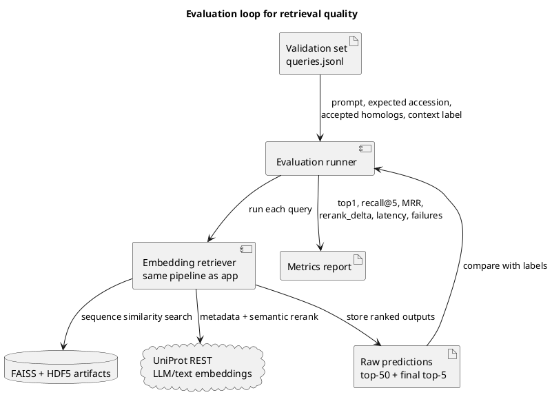

# BioSeq Investigator - TODO

## Ближайшие шаги

- [ ] Создать validation set на 30-50 запросов в JSONL/CSV.
- [ ] Построить `per-protein.index` и `per-protein.accessions.json` и положить их рядом с HDF5 в Hugging Face Dataset.
- [ ] Обновить unit/smoke tests под текущее окружение.
- [ ] Прогнать end-to-end retrieval на validation set и посчитать `top1`, `recall@5`, `MRR`, `rerank_delta`, latency.
- [ ] Добавить короткий evaluation script, который можно запускать перед демо и включать результаты в финальный отчет.

## Открытые вопросы и блокеры

- [ ] Validation set нужно материализовать в репозитории. Сейчас план оценки описан, но нет стабильного файла с query, expected accession, acceptable homologs и context labels.
- [ ] Нужно заранее построить и сохранить FAISS index/cache. Лучше хранить эти артефакты рядом с HDF5 в Hugging Face Dataset, чтобы первый запуск не строил индекс заново.
- [ ] Нужно решить runtime mode: local vs services. В `bioseq_retriever` есть service mode (`embedding_service.py`, `search_service.py`), но Streamlit adapter сейчас принудительно использует local mode через `BIOSEQ_USE_SERVICES=false`.
- [ ] Нужно обновить тесты. Есть минимум два устаревших ожидания: DNA translation unit test и smoke test для missing dependencies.
- [ ] Нужно ограничить biomedical claims. Проект должен оставаться identification/research assistant, а не медицинским советчиком.
- [ ] Follow-up Q&A пока не является полноценным evidence-grounded chat. UI и session persistence готовы, но follow-up agent еще требует отдельной реализации.

## Evaluation

- [ ] Зафиксировать validation set в отдельном файле, например `report/VALIDATION_SET.md` или `data/validation/queries.jsonl`.
- [ ] Подготовить 30-50 validation queries по следующим группам:

| Группа | Пример | Цель проверки |
|---|---|---|
| Exact known proteins | canonical UniProt protein sequence + expected accession | Проверить top-1/top-5 retrieval |
| Close homologs | последовательность из близкого организма/семейства | Проверить, что top-k содержит биологически близкие белки |
| DNA coding sequence | CDS, который переводится в известный белок | Проверить DNA/protein classification и translation |
| Context-sensitive queries | sequence + "involved in insulin/glucose/immune..." | Проверить, что semantic rerank поднимает контекстно релевантные записи |
| Ambiguous/short inputs | короткие или спорные последовательности | Проверить confidence и controlled failure |
| Negative/out-of-distribution | мусорный ввод или sequence вне набора | Проверить error handling и честные сообщения |

- [ ] Посчитать retrieval quality metrics:
  - `sequence_type_accuracy`: точность классификации DNA/protein.
  - `extraction_success_rate`: доля запросов, где последовательность/FASTA/path извлечены правильно.
  - `top1_accuracy`: совпадение expected accession с первым результатом.
  - `recall@5` и `recall@10`: наличие expected accession или допустимого homolog в top-k.
  - `MRR`: насколько высоко стоит правильный accession.
  - `nDCG@5`: качество ранжирования, если для запроса есть несколько graded-relevant кандидатов.
  - `rerank_delta`: изменение позиции релевантного кандидата после semantic rerank.
  - `latency_p50/p95`: время одного turn-а, отдельно cold start и warm start.
  - `failure_rate`: ошибки LLM provider, UniProt API, FAISS/index loading.
  - Qualitative rubric для ответа UI: groundedness, uncertainty, usefulness, отсутствие unsupported biomedical claims.

## Artifacts

- [ ] Построить `per-protein.index` и `per-protein.accessions.json`.
- [ ] Загрузить `per-protein.index` и `per-protein.accessions.json` рядом с HDF5 в Hugging Face Dataset.
- [ ] Проверить first boot: файлы должны скачиваться из Hugging Face Dataset и попадать в runtime cache без ручной подготовки.
- [ ] После готовности artifacts прогнать полный retrieval evaluation.

Примечание: retrieval quality metrics пока не посчитаны, потому что нет зафиксированного validation set и пока не найден готовый `per-protein.index`/`accessions.json` в runtime cache. До появления готовых artifacts первый полный запуск может включать тяжелый build FAISS index из HDF5. Целевой вариант - хранить эти файлы в Hugging Face Dataset и скачивать их на first boot.
