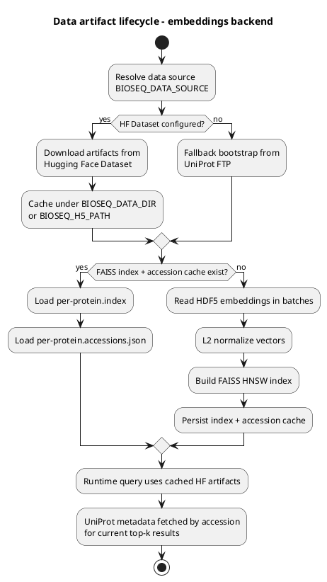
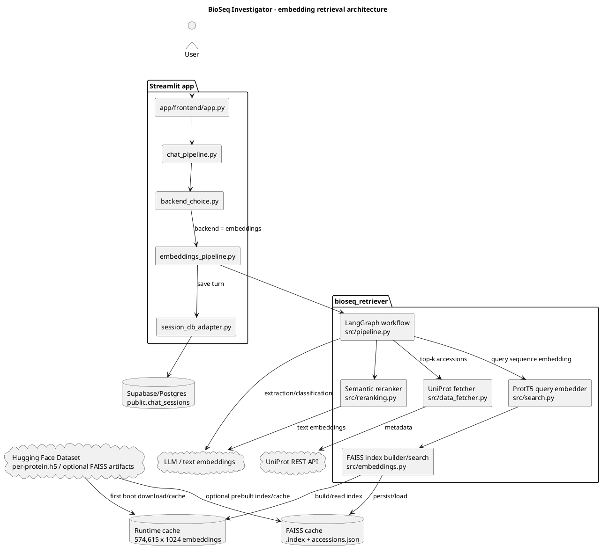
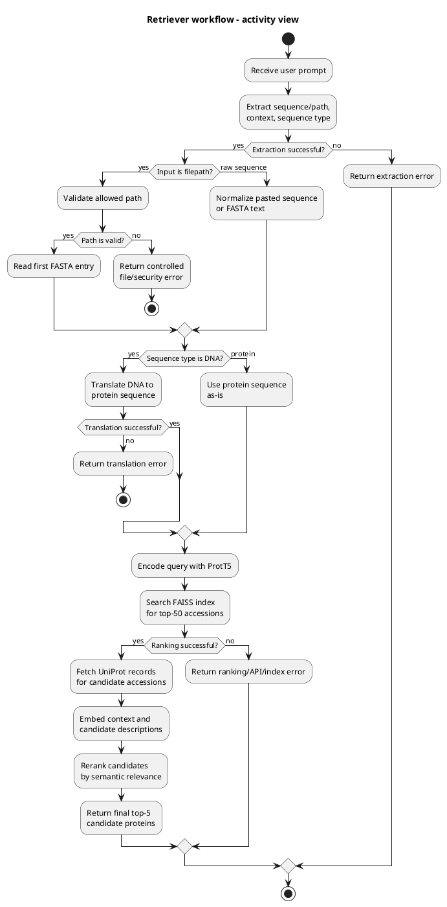
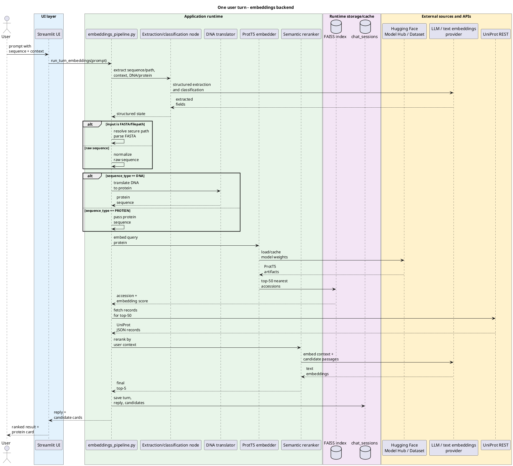
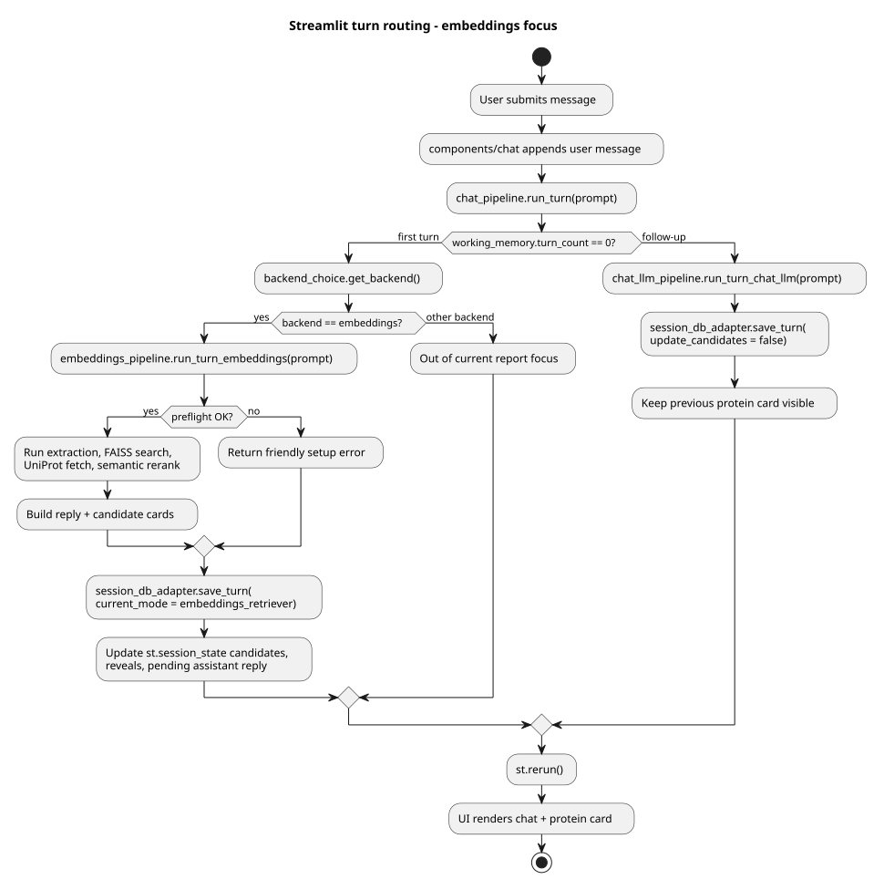
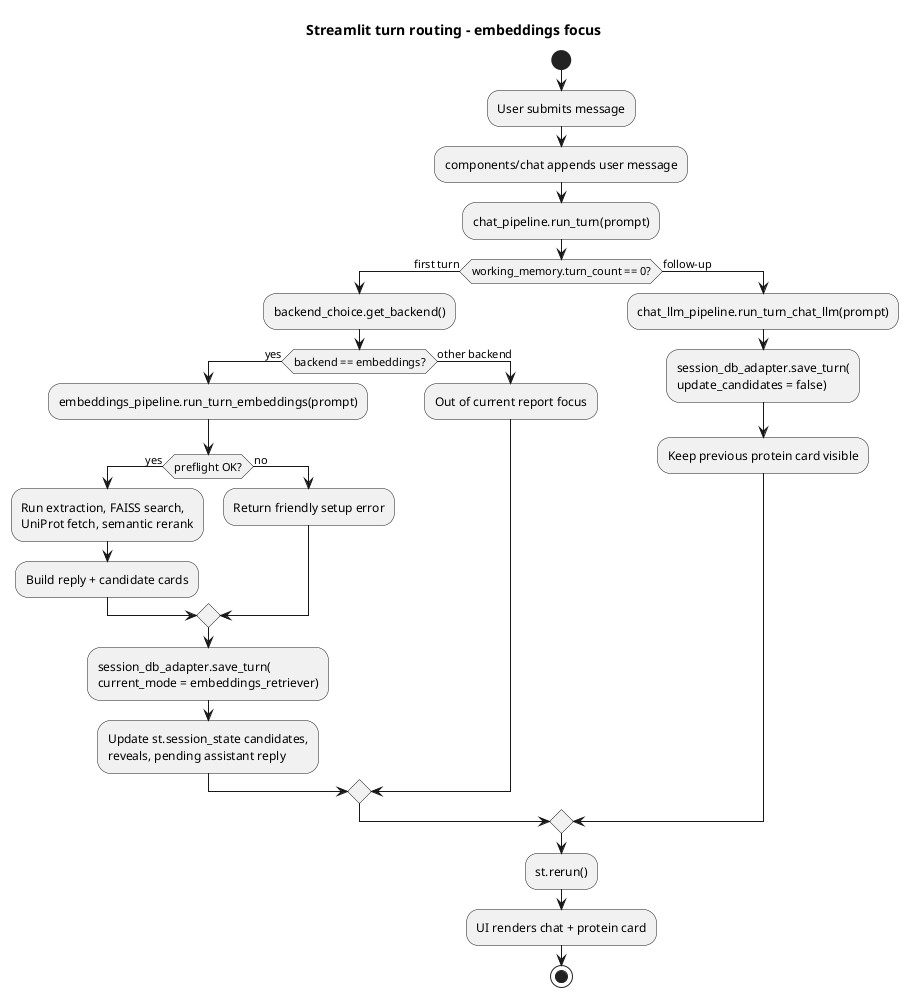
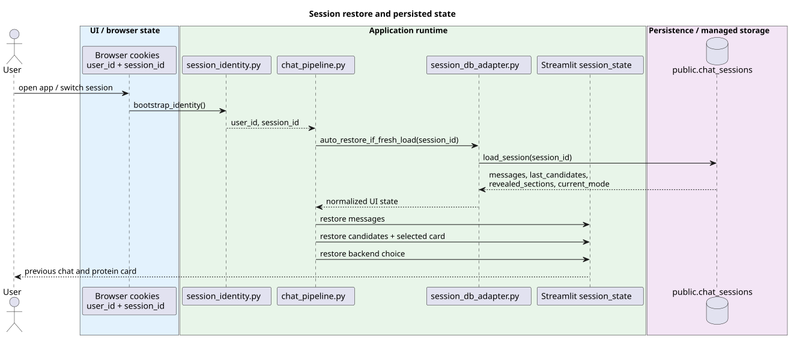
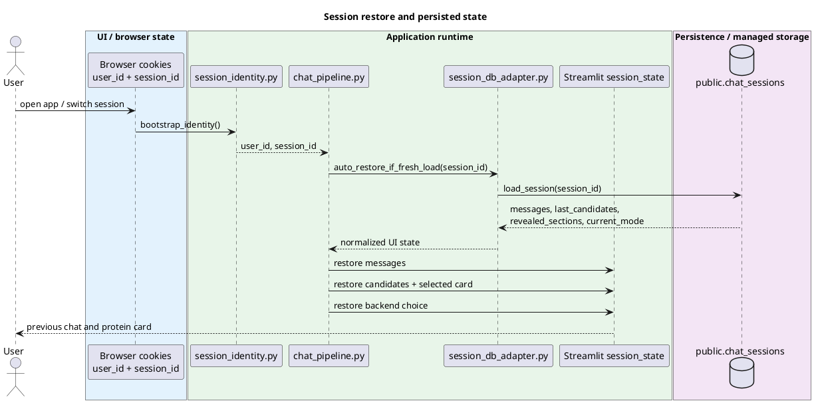

# BioSeq Investigator - промежуточный отчет

## 1. Краткое описание проекта и текущий статус

BioSeq Investigator - прототип исследовательского ассистента для биологических последовательностей. Пользователь вставляет DNA или protein sequence и задает вопрос естественным языком; система извлекает последовательность, определяет тип молекулы, при необходимости переводит DNA в protein sequence, ищет похожие белки по ProtT5-эмбеддингам, подтягивает аннотации из UniProt и возвращает top-k кандидатов с карточкой белка.

Целевая ценность MVP: дать студенту, преподавателю или исследователю быстрый способ понять, на что похожа неизвестная последовательность, какие есть известные функции/организмы/гены и насколько результат надежен.

Текущий статус:

- Данные для embedding-поиска идентифицированы и должны быть доступны через Hugging Face; локальная копия используется только как cache для разработки/запуска.
- Тяжелые модели и датасеты сейчас рассматриваются как Hugging Face artifacts: ProtT5 загружается из Hugging Face Model Hub, а embedding dataset должен доставляться через Hugging Face Dataset.
- Реализован  embedding retriever: `bioseq_retriever/src/pipeline.py`.
- Реализована Streamlit-интеграция embedding retriever: `app/frontend/embeddings_pipeline.py`.
- Поддержаны LLM extraction/classification, DNA->protein translation, ProtT5 query embedding, FAISS top-k search, UniProt metadata fetch и semantic rerank.
- UI уже умеет выбирать backend `embeddings` через `app/frontend/backend_choice.py` и сохранять ход в session persistence через `app/frontend/session_db_adapter.py`.

Основные ссылки:

- [Архитектурное описание приложения](ARCHITECTURE.md)
- [Embedding adapter для Streamlit](../app/frontend/embeddings_pipeline.py)
- [Core pipeline](../bioseq_retriever/src/pipeline.py)
- [FAISS/HDF5 indexing](../bioseq_retriever/src/embeddings.py)
- [ProtT5 search](../bioseq_retriever/src/search.py)
- [Semantic reranking](../bioseq_retriever/src/reranking.py)
- [UniProt fetcher](../bioseq_retriever/src/data_fetcher.py)

## 2. Данные

### 2.1 Источники данных

Основной источник данных - UniProt protein embeddings:

- Source type: precomputed per-protein embeddings from UniProt.
- Runtime metadata source: UniProt REST API, endpoint `https://rest.uniprot.org/uniprotkb/search`.
- Current distribution/storage approach: модели и большие датасеты доставляются через Hugging Face, а не хранятся как основной источник внутри репозитория.
- Protein embedding model: `Rostlab/prot_t5_xl_uniref50` загружается из Hugging Face Model Hub.
- Dataset artifacts: `per-protein.h5` и, при наличии, заранее собранные `per-protein.index` / `per-protein.accessions.json` могут подтягиваться из Hugging Face Dataset через `BIOSEQ_DATA_SOURCE=hf:OWNER/DATASET`; см. `bioseq_retriever/src/bootstrap.py`.
- Local files are treated as runtime cache / development copy. Source of truth для тяжелых артефактов - Hugging Face storage.

### 2.2 Формат хранения

Текущий storage layout:

| Artifact | Формат | Назначение |
|---|---:|---|
| `per-protein.h5` | HDF5 | Precomputed protein embeddings, один dataset на accession; source/distribution - Hugging Face Dataset, local copy - runtime cache |
| `per-protein.index` | FAISS index | Ускоряет top-k поиск, чтобы не строить index на cold start; целевой storage - рядом с HDF5 в Hugging Face Dataset |
| `per-protein.accessions.json` | JSON | Соответствие FAISS index row -> UniProt accession; целевой storage - рядом с FAISS index в Hugging Face Dataset |
| UniProt records | JSON from REST API | Метаданные кандидатов: name, organism, gene, function comments и др.; fetch at runtime |
| `public.chat_sessions` | Postgres/Supabase JSONB | История чата, выбранные кандидаты, режим backend-а; используется при наличии `SUPABASE_DB_URL` |

### 2.3 Preprocessing / chunking

Классического text chunking здесь нет: единица поиска - белок/последовательность, а не фрагмент документа.

Preprocessing pipeline:

1. HDF5 embeddings читаются батчами через `bioseq_retriever/src/embeddings.py`.
2. Вектора нормализуются L2-нормой.
3. Из них строится FAISS HNSW index с inner product / cosine similarity.
4. Список accession сохраняется отдельно в JSON cache.
5. Пользовательский protein query кодируется ProtT5 моделью `Rostlab/prot_t5_xl_uniref50`, которая загружается из Hugging Face Model Hub и кешируется в runtime environment.
6. Если вход - DNA, перед поиском выполняется translation по стандартной codon table.
7. Для semantic rerank top-50 результатов UniProt records форматируются в короткие текстовые passages и сравниваются с пользовательским контекстом через text embeddings.

### 2.4 Жизненный цикл data artifacts

Диаграмма разделяет долгоживущие артефакты retrieval-слоя и данные, которые загружаются в runtime для обработки конкретного запроса.

PlantUML source

## 3. Архитектура pipeline

В текущем embedding-фокусе система состоит из Streamlit UI, adapter layer, core retrieval pipeline, Hugging Face backed data/model artifacts, runtime cache и внешних API для LLM/text embeddings и UniProt metadata.

PlantUML source

### 3.1 Внутренний workflow retriever-а

Диаграмма показывает retriever как исполняемый процесс: сначала вход приводится к protein sequence, затем выполняется embedding search и контекстное переранжирование.

PlantUML source

### 3.2 Runtime flow

PlantUML source

### 3.3 App routing и session persistence

Диаграмма показывает, как Streamlit-приложение выбирает обработчик user turn, сохраняет результат и поддерживает состояние карточки белка между retriever-turn и follow-up сообщениями.

PlantUML source

PlantUML source

### 3.4 Компоненты и взаимодействие

| Компонент | Ответственность |
|---|---|
| `app/frontend/embeddings_pipeline.py` | Streamlit adapter: preflight, lazy imports, cached resources, unified response shape, persistence |
| `bioseq_retriever/src/pipeline.py` | LangGraph workflow: extract -> resolve/raw -> translate/pass -> rank -> rerank |
| `bioseq_retriever/src/search.py` | ProtT5 model loading, query embedding, FAISS top-k search |
| `bioseq_retriever/src/embeddings.py` | HDF5 batch reading, L2 normalization, HNSW index build/load, accession cache |
| `bioseq_retriever/src/reranking.py` | Converts UniProt records to text passages and reranks by semantic similarity to user context |
| `bioseq_retriever/src/data_fetcher.py` | Fetches UniProt metadata by accession |
| `bioseq_retriever/services/*` | Optional microservices for embedding/search when heavy runtime should be isolated |
| `app/frontend/session_db_adapter.py` | Persists chat turn and top candidates into Postgres/Supabase |

## 4. Предварительные результаты и проверки

Что уже проверено локально:

1. Unit tests for retriever utilities:
   - команда: `PYTHONPATH=bioseq_retriever .venv/bin/python -m unittest bioseq_retriever.tests.test_pipeline bioseq_retriever.tests.test_enhancements`;
   - результат: 9/10 passed;
   - один failure в `test_dna_translation`: тест ожидает `ATGATGATG -> MDD`, тогда как стандартная codon table возвращает `MMM`. Это выглядит как устаревшее/ошибочное ожидание теста, а не ошибка translation logic.

2. Smoke test status:
   - `scripts/smoke_embeddings_dispatch.py` сейчас падает на assertion, потому что тест ожидает отсутствие heavy ML dependencies;
   - в текущем окружении dependencies уже установлены, поэтому preflight возвращает `OK`;
   - smoke-тест нужно обновить под два сценария: "dependencies missing" и "dependencies installed".
