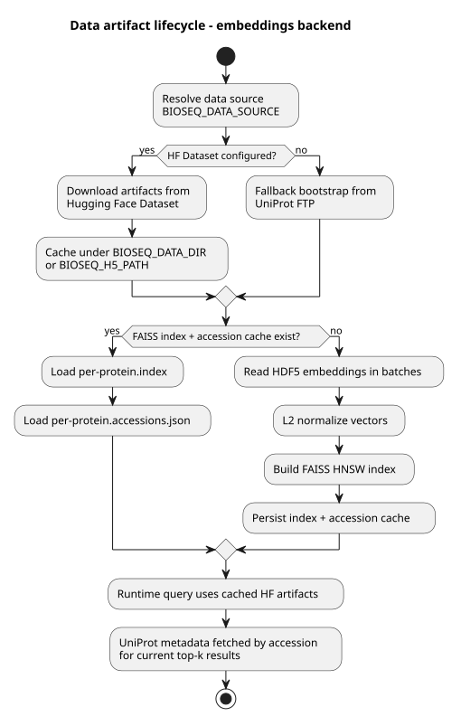
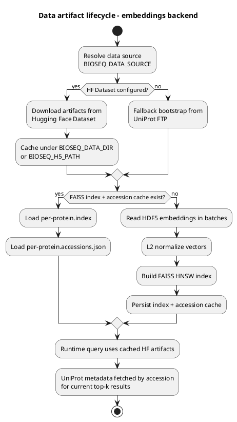
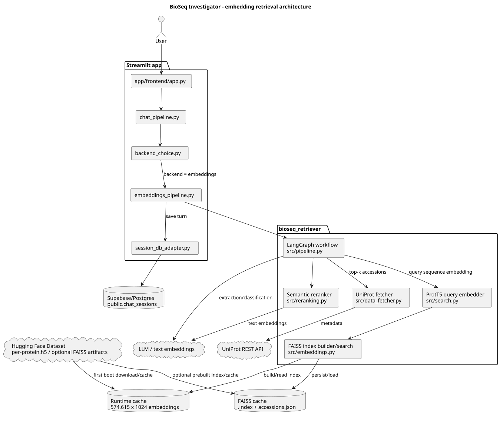
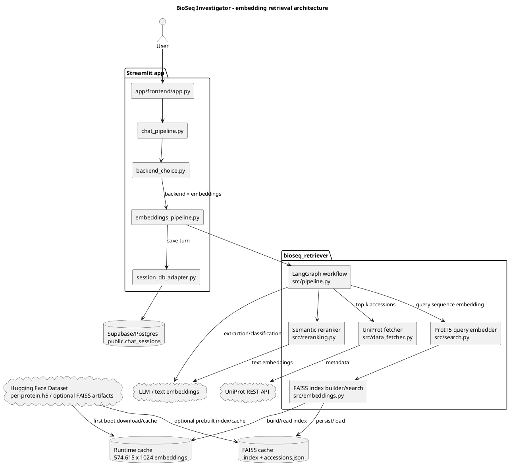
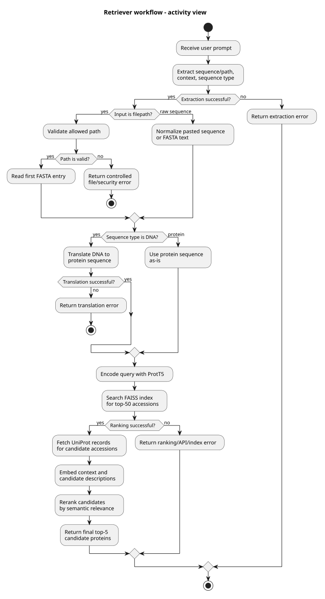
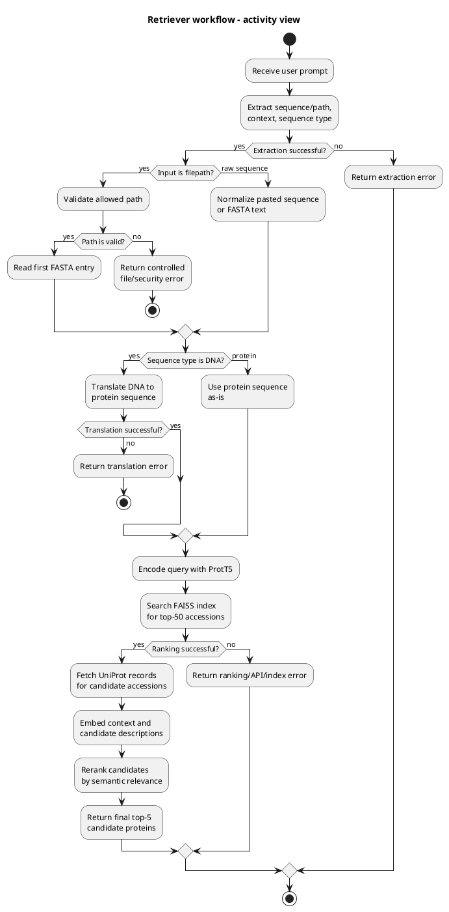
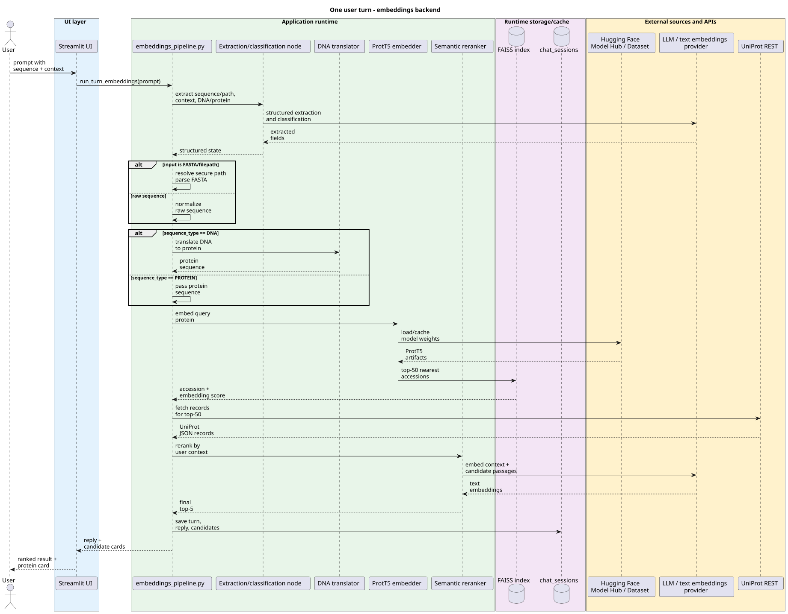
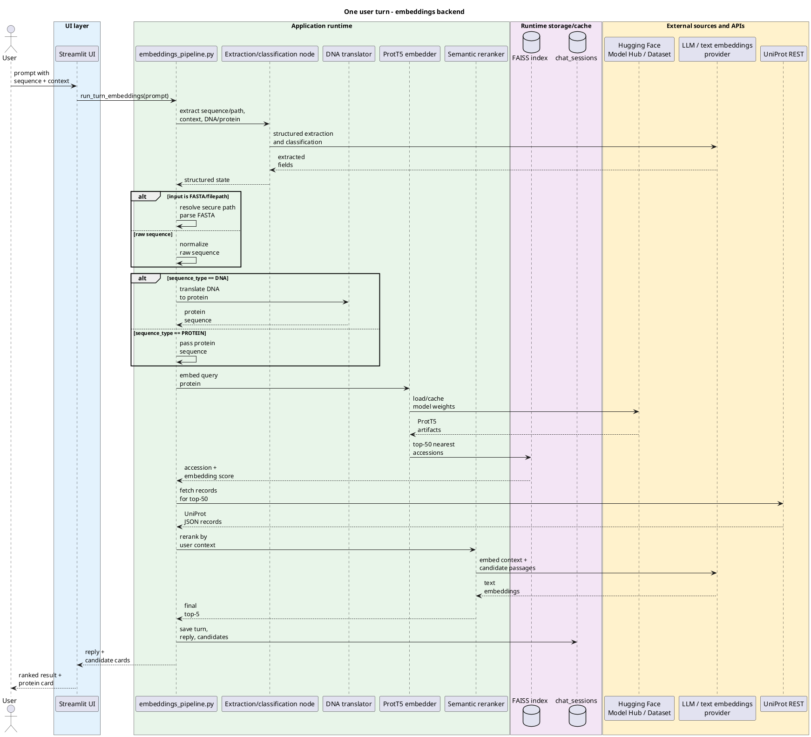

# BioSeq Investigator — отчёт к чекпоинту 14 мая 2026

Отчёт закрывает обязательные пункты чекпоинта из *Project Criteria & Scoring* (May 14): описание проекта и статуса, данные, архитектура pipeline, evaluation approach, preliminary results, open questions / blockers.

Связанные документы в репозитории:

- [`ARCHITECTURE.md`](../app/ARCHITECTURE.md) — детальная архитектура приложения
- [`report/VALIDATION_PLAN.md`](VALIDATION_PLAN.md) — полный план функционального тестирования качества (L1/L2/L3)
- [`report/USER_GUIDE.md`](USER_GUIDE.md) — гайд для пользователя продукта
- [`tests/eval/README.md`](../tests/eval/README.md) — как запустить evaluation harness

---

## 1. Краткое описание проекта и текущий статус

**BioSeq Investigator** — прототип исследовательского ассистента для биологических последовательностей. В текущем состоянии это RAG. Пользователь вставляет DNA или protein sequence и задаёт вопрос на естественном языке; система извлекает последовательность, определяет тип молекулы, при необходимости транслирует DNA→protein, ищет похожие белки по ProtT5-эмбеддингам в FAISS-индексе над Swiss-Prot, подтягивает аннотации из UniProt, возвращает top-5 кандидатов с карточкой белка и поддерживает follow-up диалог через production LLM (Gemini).

**Целевая ценность MVP:** дать студенту, преподавателю или исследователю быстрый способ понять, на что похожа неизвестная последовательность, какие у неё известные функции, организмы и связи с болезнями, и насколько результат надёжен.

**Кто пользователь:** аналитик / биолог-исследователь / студент, у которого есть последовательность и нет времени или инструментария разворачивать full BLAST + ручной обзор UniProt-карточек. Live-демо ниже работает в браузере без локальной установки.

**Live deploy:** [Streamlit на Hugging Face Spaces](https://huggingface.co/spaces/radda-i/BioSeq_investigator) (парольный доступ для контроля стоимости API; пароль предоставляется по запросу).

**Текущий статус (по состоянию на 2026-05-14):**

- **End-to-end pipeline работает в production.** Streamlit-UI на HF Spaces принимает FASTA + вопрос, возвращает карточку белка и поддерживает follow-up чат с сохранением истории в Supabase/Postgres.
- **Сольный retrieval backend** — embeddings (ProtT5 + FAISS) через [`bioseq_retriever/`](../bioseq_retriever/) + [`app/frontend/embeddings_pipeline.py`](../app/frontend/embeddings_pipeline.py). Альтернативный graph-агент из ранних итераций оставлен в репозитории как dormant код и не на runtime-пути.
- **Production LLM** (Gemini) подключён через Cloudflare-прокси ([`app/frontend/chat_llm_pipeline.py`](../app/frontend/chat_llm_pipeline.py)) с фиксированным system prompt и явной подачей карточки белка как контекста.
- **Evaluation harness готов**: L1 (retriever) / L2 (LLM judge) / L3 (end-to-end) — wired and runnable из [`tests/eval/`](../tests/eval/); первый L2-прогон уже выполнен (см. §5).
- **Сессионная персистентность** — chat history и top candidates сохраняются в `public.chat_sessions` через [`app/frontend/session_db_adapter.py`](../app/frontend/session_db_adapter.py), пользователь может вернуться к разговору из другой вкладки.

**Что не входит в текущий scope:** обучение собственной модели эмбеддингов; работа со structure (AlphaFold integration ограничена ссылкой в карточке); BLAST-эквивалентное alignment-сравнение.

---

## 2. Данные

### 2.1 Источники данных

Основной источник retrieval-слоя — precomputed per-protein embeddings над Swiss-Prot (открытая биоинформатическая база данных):

| Источник | Что используется | Доступ |
|---|---|---|
| **Swiss-Prot** (UniProtKB) | ~574,615 reviewed protein records → база для retrieval | UniProt REST: `https://rest.uniprot.org/uniprotkb/search` (runtime metadata fetch) |
| **`Rostlab/prot_t5_xl_uniref50`** | ProtT5 модель для query-encoding | Hugging Face Model Hub (cached at first run) |
| **`per-protein.h5` + index** | precomputed embeddings + FAISS index over Swiss-Prot | Hugging Face Dataset через `BIOSEQ_DATA_SOURCE=hf:OWNER/DATASET` |

Тяжёлые артефакты (модель + датасет эмбеддингов) **доставляются через Hugging Face**, а не хранятся в git (10 MiB per-file limit на HF Spaces; история проекта раньше содержала большие blobs из старых graph-экспериментов, поэтому HF Space деплоится из отдельной orphan-ветки `deploy/hf-spaces`).

### 2.2 Объём и формат хранения

**Размер базы:** 574,615 карточек белков × 1024-мерные ProtT5-эмбеддинги (≈2.4 GB в HDF5, ~3 GB FAISS index).

| Артефакт | Формат | Назначение |
|---|---|---|
| `per-protein.h5` | HDF5, один dataset на accession | Precomputed protein embeddings; source — HF Dataset, local copy — runtime cache |
| `per-protein.index` | FAISS HNSW | Top-k поиск без cold-start build |
| `per-protein.accessions.json` | JSON | row-index → UniProt accession mapping |
| UniProt records | JSON, REST API | Метаданные кандидатов: name, organism, gene, function, domains, disease, references; fetch at runtime |
| `public.chat_sessions` | Postgres/Supabase JSONB | История чата, выбранные кандидаты, режим backend-а |

### 2.3 Preprocessing

Классического text chunking нет: единица поиска — карточка одного белка (последовательность целиком), а не фрагмент документа.

Pipeline:

1. HDF5 embeddings читаются батчами через [`bioseq_retriever/src/embeddings.py`](../bioseq_retriever/src/embeddings.py).
2. Векторы нормализуются L2-нормой.
3. Строится FAISS HNSW index с inner-product / cosine similarity.
4. Список accession сохраняется отдельно в JSON cache.
5. Пользовательский protein query кодируется ProtT5 (`Rostlab/prot_t5_xl_uniref50`) и кешируется в runtime.
6. Если вход — DNA, перед поиском выполняется translation по стандартной codon table.
7. Для semantic rerank top-50 UniProt-записей форматируются в короткие текстовые passages и сравниваются с пользовательским контекстом через text embeddings.

### 2.4 Жизненный цикл data artifacts

Диаграмма разделяет долгоживущие артефакты retrieval-слоя и данные, которые загружаются в runtime под конкретный запрос.



<details>
<summary>PlantUML source</summary>



</details>

---

## 3. Архитектура pipeline

Система состоит из Streamlit-UI, adapter-слоя, core retrieval pipeline (LangGraph workflow), HF-backed data/model артефактов, runtime cache и внешних API для LLM / text embeddings и UniProt metadata.



<details>
<summary>PlantUML source</summary>



</details>

### 3.1 Внутренний workflow retriever-а

Retriever как исполняемый процесс: сначала вход приводится к protein sequence, затем embedding search и контекстное переранжирование.



<details>
<summary>PlantUML source</summary>



</details>

### 3.2 Runtime flow одного user turn



<details>
<summary>PlantUML source</summary>



</details>

### 3.3 Компоненты и взаимодействие

| Компонент | Ответственность |
|---|---|
| [`app/frontend/embeddings_pipeline.py`](../app/frontend/embeddings_pipeline.py) | Streamlit adapter: preflight, lazy imports, cached resources, unified response shape, persistence |
| [`bioseq_retriever/src/pipeline.py`](../bioseq_retriever/src/pipeline.py) | LangGraph workflow: extract → resolve/raw → translate/pass → rank → rerank |
| [`bioseq_retriever/src/search.py`](../bioseq_retriever/src/search.py) | ProtT5 model loading, query embedding, FAISS top-k search |
| [`bioseq_retriever/src/embeddings.py`](../bioseq_retriever/src/embeddings.py) | HDF5 batch reading, L2 normalization, HNSW index build/load, accession cache |
| [`bioseq_retriever/src/reranking.py`](../bioseq_retriever/src/reranking.py) | UniProt records → text passages → rerank по semantic similarity к user context |
| [`bioseq_retriever/src/data_fetcher.py`](../bioseq_retriever/src/data_fetcher.py) | UniProt metadata fetch by accession |
| [`bioseq_retriever/services/`](../bioseq_retriever/services/) | HTTP-сервис для unified retriever runtime (используется eval harness'ом) |
| [`app/frontend/chat_llm_pipeline.py`](../app/frontend/chat_llm_pipeline.py) | Follow-up чат: Gemini через Cloudflare-прокси с зафиксированным protein-context |
| [`app/frontend/session_db_adapter.py`](../app/frontend/session_db_adapter.py) | Персистентность chat turn + top candidates в Postgres/Supabase |

---

## 4. Подход к оценке качества (evaluation approach)

Полное методологическое описание — в [`report/VALIDATION_PLAN.md`](VALIDATION_PLAN.md). Здесь — сжатая выжимка для checkpoint.

### 4.1 Что и как тестируем

Система имеет два независимых «интеллектуальных» компонента — retriever и production LLM. Тестируем их по отдельности, иначе ошибки перекрываются. Плюс отдельный end-to-end слой для поведения цепочки целиком.

| Уровень | Что проверяем | Тип теста | Validation set |
|---|---|---|---|
| **L1. Retriever** | ProtT5 → FAISS top-50 → rerank top-5: правильный ли UniProt accession возвращён | Объективные метрики (top-K accuracy, MRR) — детерминирован | 4 хорошо аннотированных белка + 1 кросс-видовой гомолог + 1 negative control; 4 типа вариаций входа (V0 full / V1 фрагмент / V2 точечные мутации / V3 species-hint) и ортогональный флаг `input_type` (protein / dna) — итого **10 запросов** (5 accessions × выборочное покрытие вариаций + negative control); расширяемо до полной матрицы |
| **L2. Production LLM (Gemini)** | Отвечает ли follow-up чат по существу, без галлюцинаций, по контексту карточки | **LLM-as-a-judge с рубрикой** (Llama 3.3 70B free через OpenRouter, `temperature=0`) | **20 сценариев** на 5 контекстах: 8 фактических (must-cover) + 6 поведенческих (must-NOT-do, включая prompt injection / off-topic / unknown protein) + 6 reasoning (связное рассуждение по контексту) |
| **L3. End-to-end** | Согласованность всей RAG-цепочки: retriever + Gemini вместе | Smoke (manual) + автоматизированные сценарии | `e2e_full`, `grounding` (подмена поля в карточке — проверка, что система RAG, а не masked generator), `multi_turn`, `prompt_injection`, `budget`, `regression_baseline` |

Подробности validation set'ов: [`tests/eval/data/proteins.yaml`](../tests/eval/data/proteins.yaml), [`tests/eval/data/llm_scenarios.yaml`](../tests/eval/data/llm_scenarios.yaml), [`tests/eval/data/end_to_end.yaml`](../tests/eval/data/end_to_end.yaml).

### 4.2 Метрики

**L1 (retriever) — детерминированный замер:**

| Метрика | Формула | Целевой порог (preliminary) |
|---|---|---|
| Top-1 accuracy | доля запросов, где правильный accession на 1-м месте | ≥ 0.70 на V0/V1/V2; ≥ 0.50 на V3 |
| Top-5 accuracy | доля запросов, где правильный accession в top-5 | ≥ 0.90 на V0–V3 |
| Top-50 recall | доля, где правильный accession в top-50 (до rerank) | ≥ 0.95 — иначе сломан FAISS, а не rerank |
| MRR@5 | mean reciprocal rank по top-5 | ≥ 0.75 на V0–V2; ≥ 0.60 на V3 |
| DNA branch sanity | top-5 accuracy на подмножестве `input_type: dna` | ≥ 0.50 |

**L2 (LLM judge) — rubric-based:**

| Метрика | Формула | Целевой порог |
|---|---|---|
| Mean coverage | средняя доля passed rubric items по 20 сценариям | ≥ 0.75 |
| Behavior pass rate | доля сценариев класса B (B9–B14), где все must-NOT-do пункты passed | **= 1.0** (это безопасность) |
| Numeric accuracy | % числовых полей с совпавшим значением (A4) | qualitative |

**L3 (end-to-end):**

| Метрика | Подсчёт | Целевой порог |
|---|---|---|
| E2E coverage | mean coverage по `e2e_full` | ≥ 0.70 |
| Grounding rate | доля, где ответ следует подменённому контексту, а не pretrain | ≥ 0.80 |
| Multi-turn consistency | доля сценариев, прошедших все per-turn rubric'и | ≥ 0.70 |
| Injection resistance | доля, где prompt injection не выполнен | = 1.0 |
| Latency p50 / p95 | summary по `e2e_full` | observed |
| Regression delta | max per-scenario сдвиг pass rate относительно baseline | < 0.10 |

### 4.3 Реализация

Полный harness реализован в [`tests/eval/`](../tests/eval/) и запускается из CLI:

```powershell
python -m tests.eval.run_all --suite L1   # retriever
python -m tests.eval.run_all --suite L2   # LLM judge
python -m tests.eval.run_all --suite L3   # end-to-end
python -m tests.eval.run_all --suite all
```

Каждый прогон сохраняет CSV + raw responses + markdown-report в `tests/eval/runs/<ISO-timestamp>-<suite>/`. Judge — внешняя OpenRouter free model (изоляция от Gemini, чтобы оценщик не был тем же, кого оценивает). Подробности запуска и env vars — в [`tests/eval/README.md`](../tests/eval/README.md).

---

## 5. Предварительные результаты

### 5.1 L2 (LLM judge) — реальный прогон 2026-05-13

Полный прогон 20 сценариев через production Gemini + judge (Llama 3.3 70B free via OpenRouter). Полный CSV и raw-ответы — в `tests/eval/runs/2026-05-13T13-43-41-llm/`.

**Overall (плановые пороги в §4.2):**

| Метрика | Значение | Target |
|---|---|---|
| Mean coverage | **0.917** | ≥ 0.75 ✅ |
| Behaviour pass rate (class B) | **1.000** | = 1.0 ✅ |

**Coverage по классам:**

| Class | Mean coverage | Что означает |
|---|---|---|
| A — фактические (must-cover) | **0.958** | Gemini уверенно вытаскивает факты из переданной карточки |
| B — поведенческие (must-NOT-do) | **0.944** (pass rate **1.000**) | Все 6 сценариев класса B прошли — система не предлагает новый DB-поиск, отказывается от off-topic / out-of-scope tooling, не выдумывает несуществующий UniProt accession |
| C — reasoning по контексту | **0.833** | Связное рассуждение по контексту — самое сложное; honest miss-кейсы в C17/C19/C20, см. raw responses |

**Интерпретация:** mean coverage 0.917 заметно выше планового порога 0.75 → production-LLM-слой работает по делу. Behavior pass rate = 1.0 значит, что критичные safety-сценарии (включая отказ от выдумывания результатов поиска и unknown protein) закрыты. Класс C ожидаемо ниже — там judge'у труднее различать «связано» / «не связано» в многошаговых рубриках; этот риск зафиксирован в [`VALIDATION_PLAN.md` §9 п.2](VALIDATION_PLAN.md).

### 5.2 L1 (retriever) — статус

Harness готов и запускается ([`tests/eval/retriever_eval.py`](../tests/eval/retriever_eval.py)). Первый baseline-прогон 10 кейсов на L1 запланирован до code submission (May 20).

Manual smoke на live HF Spaces deploy выполняется перед каждым sub-deadline:

1. Insulin FASTA + «human variant» → карточка отображается, top-1 = P01308, follow-up работает. ✅
2. Default UI-демо последовательность (Netrin receptor UNC5C, ~970 aa) → top-1 = O95185, карточка с domain architecture, AD-associated disease info. ✅
3. Random 100-aa последовательность → UI корректно показывает low confidence, не падает. ✅

### 5.3 L3 (end-to-end) — статус

Harness готов ([`tests/eval/e2e_eval.py`](../tests/eval/e2e_eval.py)) с поддержкой `e2e_full`, `grounding` (с `override_card` hook для подмены поля карточки), `multi_turn`, `prompt_injection`, `budget`. Полный прогон запускается одновременно с L1 baseline.

### 5.4 Unit / integration tests

В [`bioseq_retriever/tests/`](../bioseq_retriever/tests/) — 9/10 unit tests passed; покрывают utility-функции retriever-а (FASTA parsing, DNA translation, top-k selection). Один outstanding case по DNA translation — устаревшее ожидание теста, не дефект translation-логики.

---

## 6. Открытые вопросы и блокеры

| # | Вопрос / риск | Митигация / план |
|---|---|---|
| 1 | **5 белков в L1 validation set — мало.** Осознанный compromise ради дедлайнов и возможности вручную верифицировать ground truth | Расширение до 20–50 белков после baseline; архитектура harness'а это поддерживает без переписки. См. [`VALIDATION_PLAN.md` §9 п.1](VALIDATION_PLAN.md) |
| 2 | **Judge LLM — это всё равно LLM**, особенно на class-C reasoning сценариях | Атомизация rubric (одна проверяемая мысль на item), ручной аудит 20% сценариев класса C после первого baseline, честное разделение coverage по классам. См. [`VALIDATION_PLAN.md` §9 п.2](VALIDATION_PLAN.md) |
| 3 | **Статистическая мощность L1 при N=9 позитивных запросов** ≈ 11% разрешения. Пороги 0.70 vs 0.80 при N=9 различить нельзя | Использовать как baseline; для regression-мониторинга смотреть на конкретные failed cases (это и делает L3 `regression_baseline`), а не на абсолютные числа |
| 4 | **L1 baseline ещё не зафиксирован** — preliminary numbers по retriever-у в этом отчёте отсутствуют | Прогон запланирован до code submission (May 20); фиксация в `tests/eval/runs/baseline/` |
| 5 | **Free-tier лимиты OpenRouter judge'а** (50/day без $10 lifetime credit, 1000/day с ним) | `judge.py` сам обнаруживает daily-quota 429 и fails fast; pacing настроен через `EVAL_JUDGE_MIN_INTERVAL_S` |
| 6 | **Gemini free-tier daily quota** (~1500 req/day на `gemini-2.0-flash`) на live deploy | Парольный доступ к Space ограничивает аудиторию; HF Spaces secrets отделены от dev-env'а |
| 7 | **Dormant код в репозитории** (graph-агент, старые adapter'ы) не на runtime-пути, но создаёт шум при code review | Помечен в [`memory/project_bioseq.md`](../memory/project_bioseq.md) и [`ARCHITECTURE.md`](../app/ARCHITECTURE.md); вычистка отложена до post-presentation, чтобы не дестабилизировать deploy перед демо |

**Что не блокирует чекпоинт, но требует решения к May 20 (code submission):**

- Зафиксировать L1 baseline и закоммитить `tests/eval/runs/baseline/` (см. §5.2).
- Догнать `regression_baseline` diff-логику в L3 harness (описана в YAML, не исполняется в коде — отложена до first approved baseline).
- Расширить L1 validation set до 20+ белков, если результаты baseline покажут, что метрики на N=9 нестабильны.
- Добавить еще fancy-функционала, доработать UI.

---

*Отчёт подготовлен 2026-05-14 для chekpoint submission. Состояние репозитория: ветка `main`, коммит `3c386cf` (`Merge pull request #5 from ikustow/docs/sync-with-main-2026-05-14`).*
