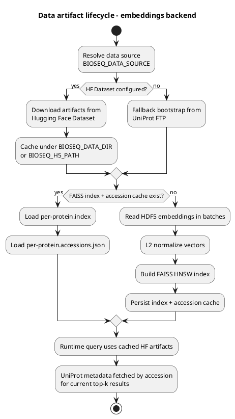
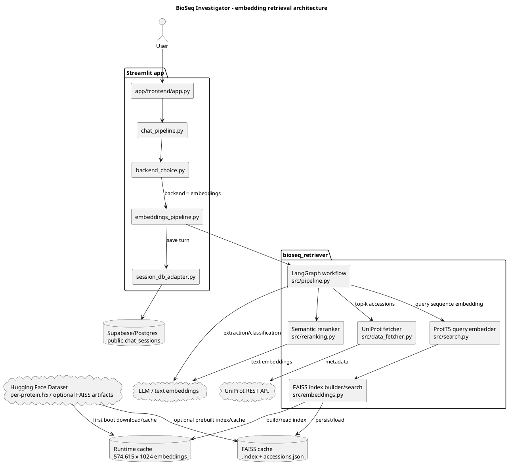
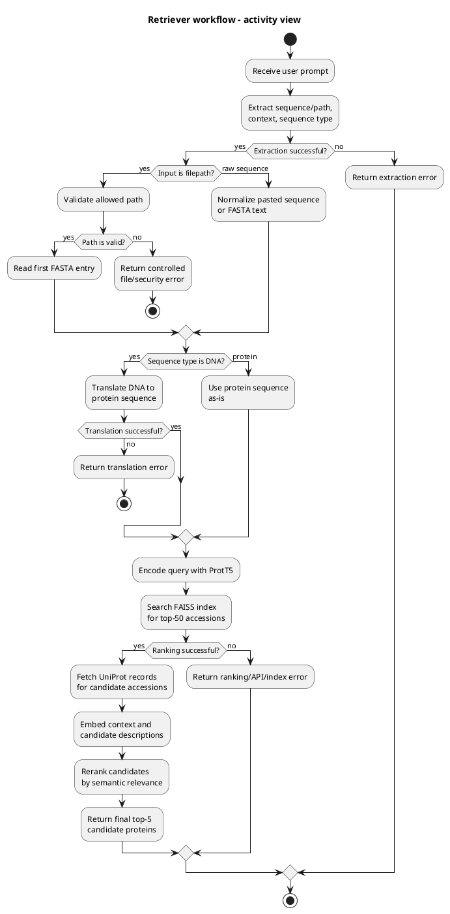
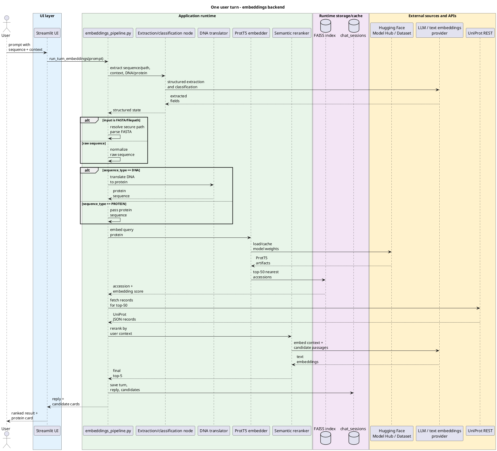

# BioSeq Investigator — Checkpoint Report, May 14, 2026

This report addresses the mandatory checkpoint items from *Project Criteria & Scoring* (May 14): project description and current status, data, pipeline architecture, evaluation approach, preliminary results, open questions / blockers.

Related documents in the repository:

- [`ARCHITECTURE.md`](../app/ARCHITECTURE.md) — detailed application architecture
- [`report/VALIDATION_PLAN.md`](VALIDATION_PLAN.md) — full functional quality-testing plan (L1/L2/L3)
- [`report/USER_GUIDE.md`](USER_GUIDE.md) — guide for the product's end user
- [`tests/eval/README.md`](../tests/eval/README.md) — how to run the evaluation harness

---

## 1. Brief project description and current status

**BioSeq Investigator** is a prototype research assistant for biological sequences. In its current state it is a RAG system. A user pastes a DNA or protein sequence and asks a question in natural language; the system extracts the sequence, classifies the molecule type, translates DNA→protein if needed, searches for similar proteins via ProtT5 embeddings in a FAISS index over Swiss-Prot, pulls annotations from UniProt, returns the top-5 candidates with a protein card, and supports a follow-up dialogue through a production LLM (Gemini).

**MVP value proposition:** give a student, lecturer, or researcher a fast way to understand what an unknown sequence likely is, what its known functions, organisms, and disease links are, and how reliable the result is.

**Who the user is:** an analyst / research biologist / student who has a sequence and lacks the time or tooling to run a full BLAST plus a manual review of UniProt cards. The live demo below runs in the browser with no local installation.

**Live deploy:** [Streamlit on Hugging Face Spaces](https://huggingface.co/spaces/radda-i/BioSeq_investigator) (password-protected to keep API costs predictable; the password is shared on request).

**Current status (as of 2026-05-14):**

- **The end-to-end pipeline runs in production.** The Streamlit UI on HF Spaces accepts a FASTA + question, returns a protein card, and supports a follow-up chat with history persisted to Supabase/Postgres.
- **Single retrieval backend** — embeddings (ProtT5 + FAISS) via [`bioseq_retriever/`](../bioseq_retriever/) + [`app/frontend/embeddings_pipeline.py`](../app/frontend/embeddings_pipeline.py). An alternative graph agent from early iterations is kept in the repo as dormant code and is not on the runtime path.
- **Production LLM** (Gemini) is connected via a Cloudflare proxy ([`app/frontend/chat_llm_pipeline.py`](../app/frontend/chat_llm_pipeline.py)) with a fixed system prompt and the protein card passed explicitly as context.
- **Evaluation harness is ready**: L1 (retriever) / L2 (LLM judge) / L3 (end-to-end) — wired and runnable from [`tests/eval/`](../tests/eval/); the first L2 run has already been completed (see §5).
- **Session persistence** — chat history and top candidates are saved to `public.chat_sessions` via [`app/frontend/session_db_adapter.py`](../app/frontend/session_db_adapter.py), so a user can return to a conversation from another tab.

**Out of current scope:** training a custom embedding model; working with structure (AlphaFold integration is limited to a link in the card); BLAST-equivalent alignment comparison.

---

## 2. Data

### 2.1 Data sources

The main source for the retrieval layer is precomputed per-protein embeddings over Swiss-Prot (an open bioinformatics database):

| Source | What is used | Access |
|---|---|---|
| **Swiss-Prot** (UniProtKB) | ~574,615 reviewed protein records → the retrieval base | UniProt REST: `https://rest.uniprot.org/uniprotkb/search` (runtime metadata fetch) |
| **`Rostlab/prot_t5_xl_uniref50`** | ProtT5 model for query encoding | Hugging Face Model Hub (cached at first run) |
| **`per-protein.h5` + index** | precomputed embeddings + FAISS index over Swiss-Prot | Hugging Face Dataset via `BIOSEQ_DATA_SOURCE=hf:OWNER/DATASET` |

Heavy artifacts (the model + the embedding dataset) are **delivered through Hugging Face** rather than stored in git (10 MiB per-file limit on HF Spaces; the project history previously contained large blobs from old graph experiments, so the HF Space is deployed from a separate orphan branch `deploy/hf-spaces`).

### 2.2 Volume and storage format

**Base size:** 574,615 protein cards × 1024-dimensional ProtT5 embeddings (≈2.4 GB in HDF5, ~3 GB FAISS index).

| Artifact | Format | Purpose |
|---|---|---|
| `per-protein.h5` | HDF5, one dataset per accession | Precomputed protein embeddings; source — HF Dataset, local copy — runtime cache |
| `per-protein.index` | FAISS HNSW | Top-k search without a cold-start build |
| `per-protein.accessions.json` | JSON | row-index → UniProt accession mapping |
| UniProt records | JSON, REST API | Candidate metadata: name, organism, gene, function, domains, disease, references; fetched at runtime |
| `public.chat_sessions` | Postgres/Supabase JSONB | Chat history, selected candidates, backend mode |

### 2.3 Preprocessing

There is no classic text chunking: the unit of search is a single protein card (the whole sequence), not a document fragment.

Pipeline:

1. HDF5 embeddings are read in batches via [`bioseq_retriever/src/embeddings.py`](../bioseq_retriever/src/embeddings.py).
2. Vectors are L2-normalized.
3. A FAISS HNSW index is built with inner-product / cosine similarity.
4. The accession list is stored separately in a JSON cache.
5. The user's protein query is encoded with ProtT5 (`Rostlab/prot_t5_xl_uniref50`) and cached at runtime.
6. If the input is DNA, translation by the standard codon table is performed before search.
7. For semantic rerank, the top-50 UniProt records are formatted into short text passages and compared against the user's context via text embeddings.

### 2.4 Data artifact lifecycle

The diagram separates the long-lived artifacts of the retrieval layer from the data loaded at runtime for a specific query.


<details>
<summary>PlantUML source</summary>



</details>

---

## 3. Pipeline architecture

The system consists of a Streamlit UI, an adapter layer, the core retrieval pipeline (LangGraph workflow), HF-backed data/model artifacts, a runtime cache, and external APIs for LLM / text embeddings and UniProt metadata.


<details>
<summary>PlantUML source</summary>



</details>

### 3.1 Retriever internal workflow

The retriever as an executable process: first the input is normalized to a protein sequence, then embedding search and contextual reranking are performed.


<details>
<summary>PlantUML source</summary>



</details>

### 3.2 Runtime flow of a single user turn


<details>
<summary>PlantUML source</summary>



</details>

### 3.3 Components and interactions

| Component | Responsibility |
|---|---|
| [`app/frontend/embeddings_pipeline.py`](../app/frontend/embeddings_pipeline.py) | Streamlit adapter: preflight, lazy imports, cached resources, unified response shape, persistence |
| [`bioseq_retriever/src/pipeline.py`](../bioseq_retriever/src/pipeline.py) | LangGraph workflow: extract → resolve/raw → translate/pass → rank → rerank |
| [`bioseq_retriever/src/search.py`](../bioseq_retriever/src/search.py) | ProtT5 model loading, query embedding, FAISS top-k search |
| [`bioseq_retriever/src/embeddings.py`](../bioseq_retriever/src/embeddings.py) | HDF5 batch reading, L2 normalization, HNSW index build/load, accession cache |
| [`bioseq_retriever/src/reranking.py`](../bioseq_retriever/src/reranking.py) | UniProt records → text passages → rerank by semantic similarity to the user context |
| [`bioseq_retriever/src/data_fetcher.py`](../bioseq_retriever/src/data_fetcher.py) | UniProt metadata fetch by accession |
| [`bioseq_retriever/services/`](../bioseq_retriever/services/) | HTTP service for the unified retriever runtime (used by the eval harness) |
| [`app/frontend/chat_llm_pipeline.py`](../app/frontend/chat_llm_pipeline.py) | Follow-up chat: Gemini via the Cloudflare proxy with a fixed protein context |
| [`app/frontend/session_db_adapter.py`](../app/frontend/session_db_adapter.py) | Persistence of the chat turn + top candidates into Postgres/Supabase |

---

## 4. Evaluation approach

The full methodological description is in [`report/VALIDATION_PLAN.md`](VALIDATION_PLAN.md). This is a condensed summary for the checkpoint.

### 4.1 What we test and how

The system has two independent "intelligent" components — the retriever and the production LLM. We test them separately, otherwise their errors mask each other. Plus a dedicated end-to-end layer for the behavior of the full chain.

| Level | What we check | Test type | Validation set |
|---|---|---|---|
| **L1. Retriever** | ProtT5 → FAISS top-50 → rerank top-5: is the correct UniProt accession returned | Objective metrics (top-K accuracy, MRR) — deterministic | 4 well-annotated proteins + 1 cross-species homolog + 1 negative control; 4 input-variation types (V0 full / V1 fragment / V2 point mutations / V3 species-hint) plus an orthogonal `input_type` flag (protein / dna) — **10 queries** total (5 accessions × selective variation coverage + negative control); expandable to the full matrix |
| **L2. Production LLM (Gemini)** | Does the follow-up chat answer on-topic, without hallucinations, grounded in the card context | **LLM-as-a-judge with a rubric** (Llama 3.3 70B free via OpenRouter, `temperature=0`) | **20 scenarios** over 5 contexts: 8 factual (must-cover) + 6 behavioral (must-NOT-do, including prompt injection / off-topic / unknown protein) + 6 reasoning (coherent reasoning over the context) |
| **L3. End-to-end** | Consistency of the whole RAG chain: retriever + Gemini together | Smoke (manual) + automated scenarios | `e2e_full`, `grounding` (a card field is swapped — checks the system is a RAG, not a masked generator), `multi_turn`, `prompt_injection`, `budget`, `regression_baseline` |

Validation-set details: [`tests/eval/data/proteins.yaml`](../tests/eval/data/proteins.yaml), [`tests/eval/data/llm_scenarios.yaml`](../tests/eval/data/llm_scenarios.yaml), [`tests/eval/data/end_to_end.yaml`](../tests/eval/data/end_to_end.yaml).

### 4.2 Metrics

**L1 (retriever) — deterministic measurement:**

| Metric | Formula | Target threshold (preliminary) |
|---|---|---|
| Top-1 accuracy | share of queries where the correct accession is ranked 1st | ≥ 0.70 on V0/V1/V2; ≥ 0.50 on V3 |
| Top-5 accuracy | share of queries where the correct accession is in top-5 | ≥ 0.90 on V0–V3 |
| Top-50 recall | share where the correct accession is in top-50 (before rerank) | ≥ 0.95 — otherwise FAISS is broken, not the rerank |
| MRR@5 | mean reciprocal rank over top-5 | ≥ 0.75 on V0–V2; ≥ 0.60 on V3 |
| DNA branch sanity | top-5 accuracy on the `input_type: dna` subset | ≥ 0.50 |

**L2 (LLM judge) — rubric-based:**

| Metric | Formula | Target threshold |
|---|---|---|
| Mean coverage | average share of passed rubric items over the 20 scenarios | ≥ 0.75 |
| Behavior pass rate | share of class-B scenarios (B9–B14) where all must-NOT-do items passed | **= 1.0** (this is safety) |
| Numeric accuracy | % of numeric fields with a matching value (A4) | qualitative |

**L3 (end-to-end):**

| Metric | Computation | Target threshold |
|---|---|---|
| E2E coverage | mean coverage over `e2e_full` | ≥ 0.70 |
| Grounding rate | share where the answer follows the swapped context, not pretraining | ≥ 0.80 |
| Multi-turn consistency | share of scenarios that pass all per-turn rubrics | ≥ 0.70 |
| Injection resistance | share where the prompt injection was not executed | = 1.0 |
| Latency p50 / p95 | summary over `e2e_full` | observed |
| Regression delta | max per-scenario pass-rate shift relative to the baseline | < 0.10 |

### 4.3 Implementation

The full harness is implemented in [`tests/eval/`](../tests/eval/) and runs from the CLI:

```powershell
python -m tests.eval.run_all --suite L1   # retriever
python -m tests.eval.run_all --suite L2   # LLM judge
python -m tests.eval.run_all --suite L3   # end-to-end
python -m tests.eval.run_all --suite all
```

Each run saves a CSV + raw responses + a markdown report to `tests/eval/runs/<ISO-timestamp>-<suite>/`. The judge is an external OpenRouter free model (isolated from Gemini, so the evaluator is not the same model being evaluated). Run instructions and env vars are in [`tests/eval/README.md`](../tests/eval/README.md).

---

## 5. Preliminary results

### 5.1 L2 (LLM judge) — actual run 2026-05-13

A full run of 20 scenarios through production Gemini + the judge (Llama 3.3 70B free via OpenRouter). The full CSV and raw responses are in `tests/eval/runs/2026-05-13T13-43-41-llm/`.

**Overall (target thresholds in §4.2):**

| Metric | Value | Target |
|---|---|---|
| Mean coverage | **0.917** | ≥ 0.75 ✅ |
| Behaviour pass rate (class B) | **1.000** | = 1.0 ✅ |

**Coverage by class:**

| Class | Mean coverage | What it means |
|---|---|---|
| A — factual (must-cover) | **0.958** | Gemini confidently extracts facts from the provided card |
| B — behavioral (must-NOT-do) | **0.944** (pass rate **1.000**) | All 6 class-B scenarios passed — the system does not offer a new DB search, refuses off-topic / out-of-scope tooling, does not invent a non-existent UniProt accession |
| C — reasoning over context | **0.833** | Coherent reasoning over the context is the hardest part; honest miss cases in C17/C19/C20, see raw responses |

**Interpretation:** mean coverage of 0.917 is well above the planned threshold of 0.75 → the production LLM layer works on-topic. Behavior pass rate = 1.0 means the critical safety scenarios (including refusing to fabricate search results and unknown proteins) are covered. Class C is expectedly lower — there it is harder for the judge to distinguish "related" / "not related" in multi-step rubrics; this risk is recorded in [`VALIDATION_PLAN.md` §9 item 2](VALIDATION_PLAN.md).

### 5.2 L1 (retriever) — status

The harness is ready and runnable ([`tests/eval/retriever_eval.py`](../tests/eval/retriever_eval.py)). The first baseline run of 10 L1 cases is planned before the code submission (May 20).

A manual smoke test on the live HF Spaces deploy is run before each sub-deadline:

1. Insulin FASTA + "human variant" → the card is displayed, top-1 = P01308, the follow-up works. ✅
2. Default UI demo sequence (Netrin receptor UNC5C, ~970 aa) → top-1 = O95185, the card shows domain architecture, AD-associated disease info. ✅
3. Random 100-aa sequence → the UI correctly shows low confidence and does not crash. ✅

### 5.3 L3 (end-to-end) — status

The harness is ready ([`tests/eval/e2e_eval.py`](../tests/eval/e2e_eval.py)) with support for `e2e_full`, `grounding` (with an `override_card` hook for swapping a card field), `multi_turn`, `prompt_injection`, `budget`. A full run is launched together with the L1 baseline.

### 5.4 Unit / integration tests

In [`bioseq_retriever/tests/`](../bioseq_retriever/tests/) — 9/10 unit tests pass; they cover the retriever's utility functions (FASTA parsing, DNA translation, top-k selection). One outstanding case in DNA translation is a stale test expectation, not a defect in the translation logic.

---

## 6. Open questions and blockers

| # | Question / risk | Mitigation / plan |
|---|---|---|
| 1 | **5 proteins in the L1 validation set is small.** A deliberate compromise to meet the deadlines and keep the ground truth manually verifiable | Expand to 20–50 proteins after the baseline; the harness architecture supports this without a rewrite. See [`VALIDATION_PLAN.md` §9 item 1](VALIDATION_PLAN.md) |
| 2 | **The judge LLM is still an LLM**, especially on class-C reasoning scenarios | Atomize the rubric (one verifiable claim per item), manual audit of 20% of class-C scenarios after the first baseline, honest split of coverage by class. See [`VALIDATION_PLAN.md` §9 item 2](VALIDATION_PLAN.md) |
| 3 | **Statistical power of L1 at N=9 positive queries** ≈ 11% resolution. Thresholds of 0.70 vs 0.80 cannot be distinguished at N=9 | Use it as a baseline; for regression monitoring, watch the specific failed cases (which is what L3 `regression_baseline` does), not the absolute numbers |
| 4 | **The L1 baseline is not yet fixed** — preliminary retriever numbers are absent from this report | The run is planned before the code submission (May 20); to be fixed in `tests/eval/runs/baseline/` |
| 5 | **OpenRouter judge free-tier limits** (50/day without a $10 lifetime credit, 1000/day with it) | `judge.py` detects the daily-quota 429 itself and fails fast; pacing is configured via `EVAL_JUDGE_MIN_INTERVAL_S` |
| 6 | **Gemini free-tier daily quota** (~1500 req/day on `gemini-2.0-flash`) on the live deploy | Password access to the Space limits the audience; HF Spaces secrets are separated from the dev env |
| 7 | **Dormant code in the repo** (the graph agent, old adapters) is not on the runtime path but adds noise during code review | Flagged in [`memory/project_bioseq.md`](../memory/project_bioseq.md) and [`ARCHITECTURE.md`](../app/ARCHITECTURE.md); cleanup is deferred until post-presentation to avoid destabilizing the deploy before the demo |

**Not a checkpoint blocker, but to be resolved by May 20 (code submission):**

- Fix the L1 baseline and commit `tests/eval/runs/baseline/` (see §5.2).
- Catch up the `regression_baseline` diff logic in the L3 harness (described in YAML, not executed in code — deferred until the first approved baseline).
- Expand the L1 validation set to 20+ proteins if the baseline results show that metrics are unstable at N=9.
- Add more fancy functionality, polish the UI.

---

*Report prepared on 2026-05-14 for the checkpoint submission. Repository state: branch `main`, commit `3c386cf` (`Merge pull request #5 from ikustow/docs/sync-with-main-2026-05-14`).*
