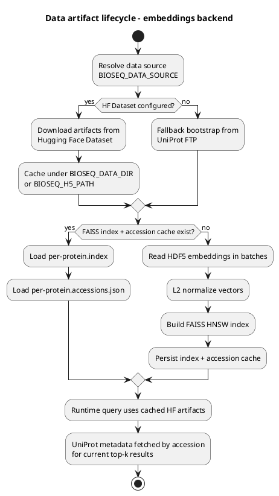
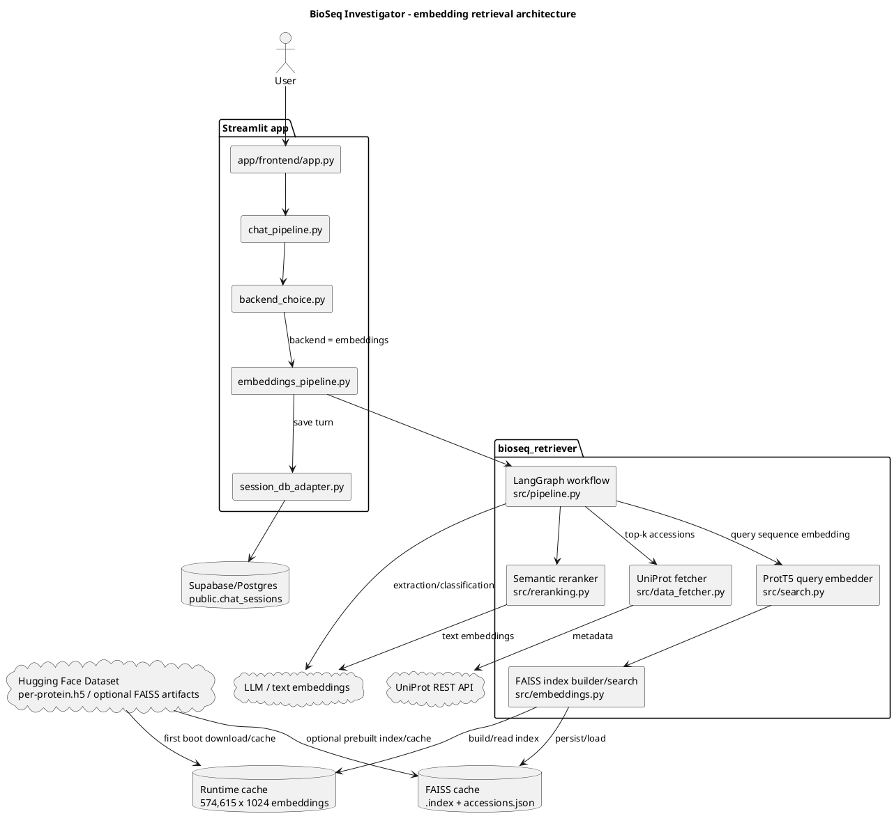
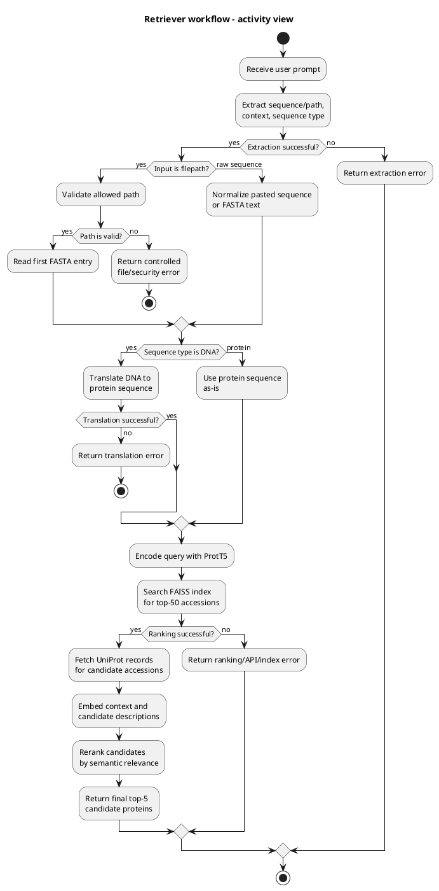
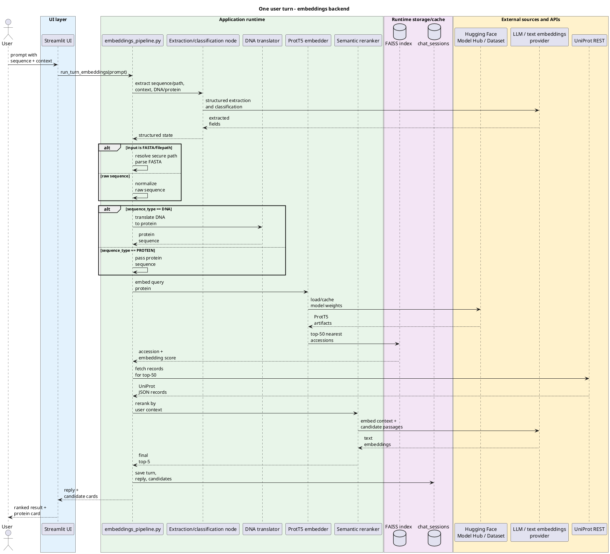
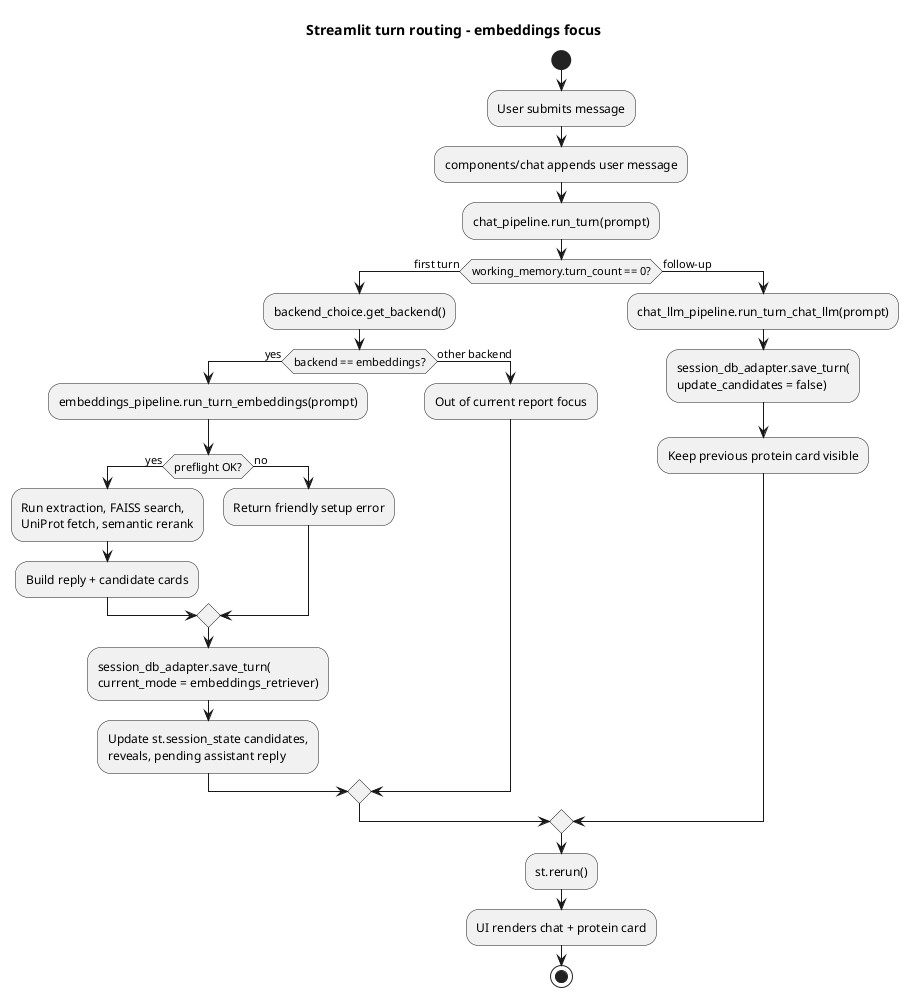
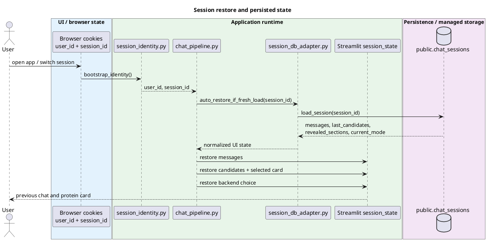

# BioSeq Investigator - Interim Report

## 1. Project Overview and Current Status

BioSeq Investigator is a prototype research assistant for biological sequences. A user pastes a DNA or protein sequence and asks a natural-language question; the system extracts the sequence, classifies the molecule type, translates DNA to a protein sequence when needed, searches for similar proteins using ProtT5 embeddings, retrieves UniProt annotations, and returns top-k candidates with a protein card.

The MVP value proposition is to help students, educators, and researchers quickly understand what an unknown sequence is similar to, which known functions/organisms/genes are associated with the result, and how reliable the result appears to be.

Current status:

- Data for embedding-based retrieval has been identified and is expected to be available through Hugging Face; local files are treated only as development/runtime cache.
- Heavy models and datasets are treated as Hugging Face artifacts: ProtT5 is loaded from Hugging Face Model Hub, while the embedding dataset should be delivered through a Hugging Face Dataset.
- The embedding retriever is implemented in `bioseq_retriever/src/pipeline.py`.
- Streamlit integration for the embedding retriever is implemented in `app/frontend/embeddings_pipeline.py`.
- The pipeline supports LLM extraction/classification, DNA-to-protein translation, ProtT5 query embedding, FAISS top-k search, UniProt metadata fetching, and semantic reranking.
- The UI can select the `embeddings` backend through `app/frontend/backend_choice.py` and persist turns through `app/frontend/session_db_adapter.py`.

Main links:

- [Application architecture](ARCHITECTURE.md)
- [Streamlit embedding adapter](../app/frontend/embeddings_pipeline.py)
- [Core pipeline](../bioseq_retriever/src/pipeline.py)
- [FAISS/HDF5 indexing](../bioseq_retriever/src/embeddings.py)
- [ProtT5 search](../bioseq_retriever/src/search.py)
- [Semantic reranking](../bioseq_retriever/src/reranking.py)
- [UniProt fetcher](../bioseq_retriever/src/data_fetcher.py)

## 2. Data

### 2.1 Data Sources

The main data source is UniProt protein embeddings:

- Source type: precomputed per-protein embeddings from UniProt.
- Runtime metadata source: UniProt REST API, endpoint `https://rest.uniprot.org/uniprotkb/search`.
- Current distribution/storage approach: models and large datasets are delivered through Hugging Face rather than treated as primary source files inside the repository.
- Protein embedding model: `Rostlab/prot_t5_xl_uniref50`, loaded from Hugging Face Model Hub.
- Dataset artifacts: `per-protein.h5` and, when available, prebuilt `per-protein.index` / `per-protein.accessions.json` can be pulled from a Hugging Face Dataset via `BIOSEQ_DATA_SOURCE=hf:OWNER/DATASET`; see `bioseq_retriever/src/bootstrap.py`.
- Local files are treated as runtime cache / development copies. The source of truth for heavy artifacts is Hugging Face storage.

### 2.2 Storage Format

Current storage layout:

| Artifact | Format | Purpose |
|---|---:|---|
| `per-protein.h5` | HDF5 | Precomputed protein embeddings, one dataset per accession; source/distribution is Hugging Face Dataset, local copy is runtime cache |
| `per-protein.index` | FAISS index | Speeds up top-k retrieval to avoid rebuilding the index on cold start; target storage is next to HDF5 in the Hugging Face Dataset |
| `per-protein.accessions.json` | JSON | Maps FAISS index row to UniProt accession; target storage is next to the FAISS index in the Hugging Face Dataset |
| UniProt records | JSON from REST API | Candidate metadata: name, organism, gene, function comments, etc.; fetched at runtime |
| `public.chat_sessions` | Postgres/Supabase JSONB | Chat history, selected candidates, backend mode; used when `SUPABASE_DB_URL` is configured |

### 2.3 Preprocessing / Chunking

There is no classical text chunking in this pipeline: the retrieval unit is a protein/sequence, not a document fragment.

Preprocessing pipeline:

1. HDF5 embeddings are read in batches via `bioseq_retriever/src/embeddings.py`.
2. Vectors are L2-normalized.
3. A FAISS HNSW index is built using inner product / cosine similarity.
4. The accession list is saved separately as a JSON cache.
5. The user's protein query is encoded with the `Rostlab/prot_t5_xl_uniref50` ProtT5 model, which is loaded from Hugging Face Model Hub and cached in the runtime environment.
6. If the input is DNA, it is translated with the standard codon table before retrieval.
7. For semantic reranking, the top-50 UniProt records are formatted into short text passages and compared with the user's context using text embeddings.

### 2.4 Data Artifact Lifecycle

The diagram separates long-lived retrieval artifacts from data loaded at runtime for a specific user query.

## 3. Pipeline Architecture

In the current embedding-focused scope, the system consists of a Streamlit UI, an adapter layer, the core retrieval pipeline, Hugging Face backed data/model artifacts, runtime cache, and external APIs for LLM/text embeddings and UniProt metadata.

### 3.1 Internal Retriever Workflow

The diagram presents the retriever as an executable process: the input is first normalized into a protein sequence, then embedding search and contextual reranking are performed.

### 3.2 Runtime Flow

### 3.3 App Routing and Session Persistence

The diagram shows how the Streamlit application selects the user-turn handler, persists the result, and keeps the protein card state stable between the retriever turn and follow-up messages.

### 3.4 Components and Responsibilities

| Component | Responsibility |
|---|---|
| `app/frontend/embeddings_pipeline.py` | Streamlit adapter: preflight, lazy imports, cached resources, unified response shape, persistence |
| `bioseq_retriever/src/pipeline.py` | LangGraph workflow: extract -> resolve/raw -> translate/pass -> rank -> rerank |
| `bioseq_retriever/src/search.py` | ProtT5 model loading, query embedding, FAISS top-k search |
| `bioseq_retriever/src/embeddings.py` | HDF5 batch reading, L2 normalization, HNSW index build/load, accession cache |
| `bioseq_retriever/src/reranking.py` | Converts UniProt records to text passages and reranks by semantic similarity to user context |
| `bioseq_retriever/src/data_fetcher.py` | Fetches UniProt metadata by accession |
| `bioseq_retriever/services/*` | Optional microservices for embedding/search when heavy runtime should be isolated |
| `app/frontend/session_db_adapter.py` | Persists chat turns and top candidates into Postgres/Supabase |

## 4. Preliminary Results and Checks

What has been checked locally:

1. Unit tests for retriever utilities:
   - command: `PYTHONPATH=bioseq_retriever .venv/bin/python -m unittest bioseq_retriever.tests.test_pipeline bioseq_retriever.tests.test_enhancements`;
   - result: 9/10 passed;
   - one failure in `test_dna_translation`: the test expects `ATGATGATG -> MDD`, while the standard codon table returns `MMM`. This appears to be an outdated/incorrect test expectation rather than an error in the translation logic.

2. Smoke test status:
   - `scripts/smoke_embeddings_dispatch.py` currently fails on an assertion because the test expects heavy ML dependencies to be missing;
   - in the current environment, these dependencies are installed, so preflight returns `OK`;
   - the smoke test should be updated to cover both scenarios: "dependencies missing" and "dependencies installed".
